### Algorithm ###
An algorithm is a procedure having well defined steps for solving a particular problem

For example : Algorithm to multiply the two numbers x and y
1. Step 1 START
2. Step 2 declare three integers x, y & z
3. Step 3 define values of x & y
4. Step 4 multiply values of x & y
5. Step 5 store the output of step 4 in z
6. Step 6 print z
7. Step 7 STOP

The major categories of algorithms are given below:
1. Sort Algorithm: Sorting the items inside a data structure either acending or decending.
2. Search Algorithm : Searching the items inside a data structure.
3. Delete Algorithm : Delere the items from a data structure.
4. Insert Algorithm :  Inserting an item inside a data structure.
4. Update Algorithm :  Updating an item inside a data structure.

### Characteristics of an Algorithm ###

1. Input: An algorithm must have 0 or well defined inputs.
2. Output: An algorithm must have 1 or well defined outputs, and should match with the desired output.
3. Feasibility: An algorithm must be terminated after the finite number of steps.
4. Independent: An algorithm must have step-by-step directions which is independent of any programming code.
5. Unambiguous: An algorithm must be unambiguous and clear. Each of their steps and input/outputs must be clear and lead to only one meaning.

### Algorithm Complexity ###
The complexity of an algorithm gives the running time and/or the storage space required by the algorithm in terms of the size of input data.

1. Space Complexity :
Space complexity of an algorithm represents the amount of memory space required by the algorithm in its life cycle. The space required by an algorithm is equal to the sum of the following two components −

  - Fixed part:  it is a space required to store certain data and variables, that are independent of the size of the problem. For example, simple variables and constants used, program size, etc.

  - variable part : it is a space required by variables, whose size depends on the size of the problem. For example, dynamic memory allocation, recursion stack space, etc.

  <table class="table table-bordered">
  <tbody><tr><th>Type</th><th>Size</th></tr>
  <tr><td>bool, char, unsigned char, signed char, __int8</td><td>1 byte</td></tr>
  <tr><td>__int16, short, unsigned short, wchar_t, __wchar_t</td><td>2 bytes</td></tr>
  <tr><td>float, __int32, int, unsigned int, long, unsigned long</td><td>4 bytes</td></tr>
  <tr><td>double, __int64, long double, long long</td><td>8 bytes</td></tr>
  </tbody></table>

  Concider following programm
  ```C
  {
    int z = a + b + c;
    return(z);
  }
  ```

  variables a, b, c and z are all integer types, hence they will take up 2 bytes each, so total memory requirement will be (8 + 2) = 10 bytes
  this additional 2 bytes is for return value. And because this space requirement is fixed
  hence it is called Constant Space Complexity.

  ```C
  // n is the length of array a[]
  int sum(int a[], int n)
  {
    int x = 0;    // 2 bytes for x
    for(int i = 0; i < n; i++)  // 2 bytes for i
    { 
        x  = x + a[i];    
    }
    return(x);
  }
  ```

  In the above code, 2*n bytes of space is required for the array a[] elements.
  2 bytes each for x, n, i and the return value.
  Hence the total memory requirement will be (2n + 8), which is increasing linearly with the increase in the input value n, hence it is called as Linear Space Complexity

2. Time Complexity :
Time complexity of an algorithm represents the amount of time required by the algorithm to run to completion
For example, addition of two n-bit integers takes n instuction. Consequently, the total computational time is T(n) = c ∗ n, where c is the time taken for the addition of two bits.

<b>Asymptotic(Asymptotic means approaching a value or curve arbitrarily closely) analysis</b> of an algorithm refers to defining the mathematical boundation/framing of its run-time performance in terms of input size.The time required by an algorithm falls under three types −

1. Best Case − Minimum time required for program execution. it express by nota
tion called Ω Notation
2. Average Case − Average time required for program execution.

3. Worst Case − Maximum time required for program execution.
it express by nota
tion called Ο(Big O) Notation

The other one asymptotic notations  is <br/>
θ Notation : it express both best case and worst case.

Consider flowing function

```C
int myFunction(int n)
{
   int x=n+10;
   x=x/2;
   return x;
}
```

Since any value of n it execute constant number of instruction . as a result it will always need same time. it express by O(1);

Consider floowing function
```C
int myFunction2(int n)
{
  int sum=0;
  for(int i=1;i<=n;i++)
  {
    sum+=i;
    if(sum>=1000) break;
  }
  return sum;
}
```

Since based on value of n number of instruction increased . although it can break but we always concider worse case . it is expressed by O(n);

```C
int myFunction3(int n)
{
int sum=0;
for(int i=1;i<=n;i++)
{
for(int j=i;j<=n;j++)
{
sum+=(i+j);
}
}
return sum;
}
```
Since first loop is running n times, 2nd loop is running n-1 times,3rd loop running n-2 times <br />
so algorithm complexitity = n + n-2 + n-3+.....+1
                           = n * (n + 1)/2
                           = (n<sup>2</sup> + n)/2 
                           = n<sup>2</sup> (n<sup>2</sup> + n and n<sup>2</sup> is very little)
                           = O(n<sup>2</sup>)

```

int binary_search(int arr[],int size,int searchitem){
   int low,mid,high,isFound = 0;
   high = size - 1;
   while(low <= high){
       mid = (low + high) / 2;
       //if midlle index found
       if(arr[mid] == searchitem){
           isFound = 1;
           break;
        }else if(searchitem < arr[mid])
           high = mid - 1;
       else
           low = mid + 1;
   }
  return isFound;  
}
```

Since here every time n is divided 2 times. <br />
How many times a number can divided by two? <br />
Ans : log<sub>2</sub>n (n = a number)<br />
it is expressed by O(log<sub>2</sub>n)

if an algorithm have (n<sup>4</sup>) , (n<sup>2</sup>) and log<sub>2</sub>n<br />
then = (n<sup>4</sup>) + (n<sup>2</sup>) + log<sub>2</sub>n<br />
= (n<sup>4</sup>) (Since (n<sup>2</sup>) + log<sub>2</sub>n is very small)

### Algorithm Technique ###

1. Greedy approach : In greedy algorithm approach, decisions are made from the given solution domain. As being greedy, the closest solution that seems to provide an optimum solution is chosen  at that moment. But it may fail where global optimization

  Example : Counting Coins, we have coins of 1, 7, 10 value, How many coins are required to get 18 ?

  Ans : 3 coins.Greedy approach forces the algorithm to pick the largest to lowest possible coin.
  - 10, the remaining count is 7
  - 7, the remaining count is 1
  - 1


  if we slightly change the problem(Count 15) then the same approach may not be able to produce the same optimum result, then greedy approach may use more coins than necessary<br/>
  10 + 1 + 1+1+1+1+1+1(6 coins)
  <br />
  Whereas the same problem could be solved by using only 3 coins (7 + 7 + 1) . (it may fail where global optimization)

  ```
  int coin[3] = { 10, 5, 2,1 } ;
   int totalChange = 16, coinRequired = 0;
   // for i = 1 to total coin decensing  order
   for(int i = 0; i <= 3; i++){
      if(totalChange >= coin[i]){
          coinRequired ++;
          totalChange -= coin[i];
      }
   }
   printf("The required coins %d", coinRequired);
  ```

Most networking algorithms use the greedy approach. Here is a list of few of them −

1. Travelling Salesman Problem
2. Prim's Minimal Spanning Tree Algorithm
3. Kruskal's Minimal Spanning Tree Algorithm
4. Dijkstra's Minimal Spanning Tree Algorithm
5. Graph - Map Coloring
6. Graph - Vertex Cover
7. Knapsack Problem
8. Job Scheduling Problem :
9. Job Sequencing Problem :
  Given an array of jobs where every job has a deadline and associated profit if the job is finished before the deadline. It is also given that every job takes single unit of time, so the minimum possible deadline for any job is 1. <br />
  How to maximize total profit if only one job can be scheduled at a time ?

  In greedy approach,
  1) Sort all jobs in decreasing order of profit.
  2) Initialize the result sequence as first job in sorted jobs( place at Scheduling List).
  3) Do following for remaining n-1 jobs
  .......a) If the current job can fit in the current result sequence 
            without missing the deadline, add current job to the result.
            Else ignore the current job.

  For Example : <br />
  

  1) Sort all jobs in decreasing order of profit.

  

  2) Initialize the result sequence as first job in sorted jobs( place at Scheduling List).

  Since job A has deadline 2 unit so it could be place at 0-1 or 1-2 seconds. we choose always latest dealine  so we choose 1-2

  

  Next job C we start looking empty backward from unit 2. 0-1 is empty slot so c is there

  

  Next job D we start looking empty backward from unit 1. 0-1 is not empty slot so skip it

  Next job B we start looking empty backward from unit 1. 0-1 is not empty slot so skip it

  Next job E we start looking empty backward from unit 3. 2-3 is  empty slot so E is there

  

  ```
  //implement using C++
  #include<iostream>
  #include<algorithm>
  using namespace std;

  struct Job{
      char id;
      int deadline;
      int profit;
  };

  bool comparison(Job a, Job b)
  {
       return a.profit > b.profit;
  }

  void printJobScheduling(Job arr[], int n){
      sort(arr, arr+n, comparison);

       int result[n]; // To store result (Sequence of jobs)
       bool slot[n];

       // Initialize all slots to be free
      for (int i=0; i<n; i++)
          slot[i] = false;
      // Iterate through all given jobs
      for (int i=0; i<n; i++){
              //min(n, arr[i].deadline)-1; slot before or after based on deadline
          for (int j=min(n, arr[i].deadline)-1; j>=0; j--){
            // Free slot found
            if (slot[j]==false)
            {
               result[j] = i;  // Add this job to result
               slot[j] = true; // Make this slot occupied
               break;
            }
          }
      }

      // Print the result
      for (int i=0; i<n; i++)
         if (slot[i])
           cout << arr[result[i]].id << " ";
  }
  // Driver program to test methods
  int main()
  {
      Job arr[] = {
                      {'a', 2, 100},
                      {'b', 1, 19},
                      {'c', 2, 27},
                      {'d', 1, 25},
                      {'e', 3, 15}
                 };
      int n = sizeof(arr)/sizeof(arr[0]);
      cout << "Following is maximum profit sequence of job :" ;
      printJobScheduling(arr, n);
      return 0;
  }

  ```

2. `Divide and Conquer` :

  In divide and conquer approach, the problem in hand, is divided into smaller sub-problems and then each problem is solved independently. When we keep on dividing the subproblems into even smaller sub-problems, we may eventually reach a stage where no more division is possible. Those "atomic" smallest possible sub-problem (fractions) are solved. The solution of all sub-problems is finally merged in order to obtain the solution of an original problem.

  Example : Convert following small alphabet to capital alphabet

  

  The following computer algorithms are based on divide-and-conquer programming approach −

  1. Merge Sort
  2. Quick Sort
  3. Binary Search
  4. Strassen's Matrix Multiplication
  5. Closest pair (points)

3. `Dynamic programming` :

  Dynamic Programming is an algorithmic paradigm that solves a given complex problem by breaking it into subproblems and stores the results of subproblems to avoid computing the same results again.

  Mostly, these algorithms are used for optimization.

  The following computer problems can be solved using dynamic programming approach −

  1. Fibonacci number series
  ```C
  void main(){
      int n;
      printf("Enter number of elements :\n");
      scanf("%d", &n);
      for(int i=0; i< n; i++)
          printf("%d ", fibonacci(i));

  }
  int fibonacci( int n ) {
      if( n == 0 ) return 0;
      if( n == 1 ) return 1;
      return fibonacci( n-1 ) + fibonacci( n-2 );
  }
  ```
  Execution time : 3.266s <br />

  Recursion tree for execution of fib(5)

  

  We can see that the function fib(3) is being called 2 times. If we would have stored the value of fib(3), then instead of computing it again, we could have reused the old stored value.

  There are following two different ways to store the values so that these values can be reused:
  a) Memoization (Top Down)

  We initialize a lookup array with all initial values as NIL. Whenever we need the solution to a subproblem, we first look into the lookup table. If the precomputed value is there then we return that value, otherwise, we calculate the value and put the result in the lookup table so that it can be reused later.

  ```C
  #include <stdio.h>
  #include <conio.h>
  int dp[20];

  void main(){
      int n;
      printf("Enter number of elements :\n");
      scanf("%d", &n);
      for(int i=0;i<20;i++)
          dp[i] = -1;
      for(int i=0; i< n; i++)
          printf("%d ", fibonacci(i));

  }
  int fibonacci( int n ) {
      if( n == 0 ) return 0;
      if( n == 1 ) return 1;
      if( dp[n] != -1 ) return dp[n];
      else{
          dp[n] = fibonacci( n-1 ) + fibonacci( n-2 );
          return dp[n];
      }
  }

  ```

  Execution time : 2.265s <br />

  b) Tabulation (Bottom Up)

  The tabulated program for a given problem builds a table in bottom up fashion and returns the last entry from table

  ```
  #include <stdio.h>
  #include <conio.h>

  void main(){
      int n;
      printf("Enter number of elements :\n");
      scanf("%d", &n);
      for(int i=0; i< n; i++)
          printf("%d ", fibonacci(i));

  }
  int fibonacci( int n ) {
      int fibonacci[n+1];
      int i;
      fibonacci[0] = 0;   fibonacci[1] = 1;
      for (i = 2; i <= n; i++)
        fibonacci[i] = fibonacci[i-1] + fibonacci[i-2];

    return fibonacci[n];
  }

  ```

  2. Knapsack problem
  3. Tower of Hanoi
  4. All pair shortest path by Floyd-Warshall
  5. Shortest path by Dijkstra
  6. Project scheduling

### Data Structure ###
Data Structure is a way to organized data in such a way that it can be used efficiently.Almost every enterprise application uses various types of data structures e.g array,linked list

### Data Structure Type ###
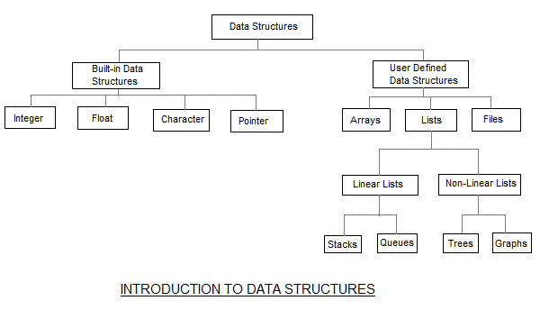

- Linear: A data structure is said to be linear if its elements form a sequential memory locations. The other way is to have the linear relationship between the elements represented by means of pointers or links. Ex- Array and Link List.

- Non-linear: A data structure is said to be non-linear if its elements a hierarchical relationship between elements such as trees and graphs.

We will discuss important data  structure array, linked list, tree, graph

### Data Structure Operations ###
1. Traversing : print all the array elements one by one.
2. Searching : Searches an element using the given index or by the value.
3. Insertion : Adds an element at the given index.
4. Update : Updates an element at the given index.
5. Deletion : Deletes an element at the given index.
6. Sorting : Managing the data or record in some logical order(Ascending or descending order).
7. Merging : Combining the record in two different sorted data structure into a single sorted data structure.


### Array ###
Array is a collection of elements of similar data type.
Following are the important terms to understand the concept of Array.

1. Element − Each item stored in an array is called an element.

2. Index − Each location of an element in an array has a numerical index, which is used to identify the element.


C array declaration.


here size declaration optional

### Need of using Array ###
n computer programming, the most of the cases requires to store the large number of data of similar type. To store such amount of data, we need to define a large number of variables. It would be very difficult to remember names of all the variables while writing the programs. Instead of naming all the variables with a different name, it is better to define an array and store all the elements into it.

we have marks of a student in six different subjects. The problem intends to calculate the average of all the marks of the student.

```
#include <stdio.h>
void main ()
{
    int marks_1 = 56, marks_2 = 78, marks_3 = 88, marks_4 = 76, marks_5 = 56, marks_6 = 89;
    float avg = (marks_1 + marks_2 + marks_3 + marks_4 + marks_5 +marks_6) / 6 ;
    printf("%f",avg);
}

```
here 6 variable define and add those  variable. but when weh have 1000 students then it will be difficult to program above way.

In array, Only single name(array variable) for the group of variables of the same type

```C
#include <stdio.h>
void main ()
{
    int marks[6] = {56,78,88,76,56,89);  
    int i,float sum;  
    for (i=0; i<6; i++ )   
        sum += marks[i];   
    
    printf("%f",sum/6);
}

```

Array data structure operation

```C
#include <stdio.h>
int array[] = {1,3,5,7,8};
int  n = 4;
void travers(int array[]){
    for(int i = 0; i < n; i++)
        printf("array[%d] = %d \n", i, array[i]);
}
void insert(int value){
    array[n++] = value;
}
void update(int value, int updateIndex){
    array[updateIndex] = value;
}
void delete(int indexDelete){
   int j = indexDelete;
   while( j < n) {
      array[j-1] = array[j];
      j++;
   }
   n--;
}
void search(int searchValue){
    for(int i = 0; i < n; i++){
        if(array[i] == searchValue)
            printf("Found element %d at position %d\n", searchValue, i);
    }
}
main() {
   printf("The original array elements are :\n");

   travers(array);
   insert(10);
   printf("The array elements after insertion :\n");
   travers(array);

   update(12, 0);
   printf("The array elements after update :\n");
   travers(array);

   delete(3); // delete 3th position(value 5)
   printf("The array elements after deletion :\n");
   travers(array);

   search(3);
}

```
### Array Use ###
1. Almost every application more / less use array

### linked-list ###
Array contains following limitations:

1. The size of array must be known in advance before using it in the program.it is almost impossible to expand the size of the array at run time.
2. All the elements in the array need to be contiguously stored in the memory. Inserting / Deleting any element in the array needs shifting of all its predecessors.

Linked list is the data structure which can overcome all the limitations of an array becuase
1. It allocates the memory dynamically(run time)
2. Ease of insertion/deletion
As a result try to use linkedlist instead of array

Drawbacks:
1. Random access is not allowed.We have to access elements sequentially starting from the head node and then compare random value to node value and return . as a result greatly increasing the time periods required to access individual elements within the list
For this behaviour, we cannot do binary search with linked lists.
2. Extra memory space for a pointer is required with each element of the list.


A linked-list is collection of objects called node/element. A node contains two field
- data :  Each item stored in an linked-list is called an data.
- Link/Next : it contains the address of the next node in the memory.

Note :
- Head : the first node is called head
- Trail : the last node is called trail.  its link contains NULL.

In C

```
struct Node
{
  int data;
  struct Node *link;
};
```

`Insert Operation :` We can add node by three ways
1. Inserting beginning of the list (implement below code)
Algorithm:
    - allocate node
    - put in the data
    - Make next of new node as head
    - move the head to point to the new node

```C
#include <stdio.h>
struct node
{
   int data;
   struct node *next;
};
struct node *head = NULL;

void insert(int data)
{
   //create a node
   struct node *myNode = (struct node*) malloc(sizeof(struct node));
   myNode->data = data;
   myNode->next = head;

   //myNode is head now
   head = myNode;
}

void travers(struct node *node){

   while(node != NULL){
      printf("%d ",node->data);
      node = node->next; // loop while last node( we know last node link is NULL)
   }
}

void main() {
   insert(3);
   insert(10);
   printf("The linked list elements after insertion :\n");
   travers(head);
}
```    
2. Inserting the second last node of the list and the new node will point to NULL.

```C
//create a node
struct node *myNode = (struct node*) malloc(sizeof(struct node));
myNode->data = data;
myNode->next = NULL;

current = head;
while(current != NULL){
  current = current->next; 
}

current->next=myNode;
```
3. Inserting in the middle of the two node
suppose inserting a node B  between A  and C 

```C
b.next −> C;
a.next −> b;
```

`Update Operation :` 

```C
struct node *current = NULL;
void update(int oldData, int newData) {
   current = head; //make a copy of head node
   while(current->next != NULL) {
      if(current->data == oldData) {
         current->data = newData;
         return;
      }
      current = current->next;
   }
   printf("%d does not exist in the list\n", oldData);
}
```

main()

```C
update(10, 12);
printf("\nThe linked list elements after update :\n");
travers(head);
```


`Search Operation :` 

```C
void search(int searchValue){
   current = head;
   while(current != NULL) {
      if(current->data == searchValue) {
         printf("found %d", searchValue);
         break;
      }
     current = current->next;
   }
}
```

main()

```C
search(3);
```

`Delete Operation` : 

```C
void delete(int deleteData){
   struct node* previous = NULL;

   current = head; //make a copy of head node
   while(current != NULL) {
      if(current->data == deleteData) {
         previous->next = current->next;
         //we just point next node. but actual delete not happen .below lines actual delete that node
         delete(current);
         break;
      }
      previous = current;
      current = current->next;
   }
}
```

main()

```C
delete(3);
printf("\nThe linked list elements after deletion :\n");
travers(head);
```


### Types of Linked List ###

1. Simple Linked List  :  that is discuss above

2. Doubly Linked List : 
  Simple Linked List have following drawback:
  - Insert Operation : Inserting the second last node of the list or Inserting in the middle of the two node we need the list is traversed it is inefficient
  - Delete Operation : We saw that to delete a node, always remember previous node . 
    To get this previous node, we need the list is also traversed
  - Item travers is forward only

  To overcome such problem add  an extra link(called previous) on every node of simple linked list.Then It sturcutre called Doubly Linked List (DLL) 

  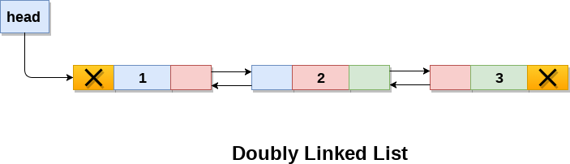

  Disadvantages over singly linked list
  - Every node of DLL require extra space for an previous pointer
  - All operations require an extra pointer previous to be maintained. For example, in insertion, we need to modify previous pointers together with next pointers that will  take more time

  Insertion: A node can be added in four ways
  - At the beginning of the DLL: Algorithm below
    - allocate node 
    - put in the data 
    - Make next of new node as head and previous as NULL 
    - change prev of head node to new node
    - move the head to point to the new node 

```C
#include <stdio.h>
struct node
{
   struct node *prev;
   int data;
   struct node *next;
};
struct node *head = NULL;
struct node *current = NULL; //travers purpose
void traversForword(){
   current = head;
   while(current != NULL){
      printf("%d ",current->data);
      current = current->next;
   }
}

void traversBackword(){
   current = head;
   while(current != NULL){
      printf("%d ",current->data);
      current = current->prev;
   }
}

void insertBegining(int data)
{
   //create a node
   struct node *myNode = (struct node*) malloc(sizeof(struct node));
   myNode->data = data;
   myNode->next = head;
   myNode->prev = NULL;

   if (head != NULL)
        head->prev = myNode;

   //myNode is head now
   head = myNode;
}


main() {
   insertBegining(3);
   insertBegining(10);
   printf("The Double linked list elements after insertion :\n");
   traversForword(head);
}

```
  - After a given node.
    - check if the given prev_node is NULL 
    - allocate new node 
    - put in the data  
    - Make next of new node as next of prev_node 
    - Make the next of prev_node as new_node 
    - Make prev_node as previous of new_node 
    - Change previous of new_node's next node
    [GitHub](https://www.geeksforgeeks.org/doubly-linked-list/)
  - At the end of the DLL
  - Before a given node.

3. Circular Linked List − Last item contains link of the first element as next and the first element has a link to the last element as previous.
[GitHub](https://www.geeksforgeeks.org/circular-linked-list)

### Linked List Use ###
1. Create different types of tree(e.g binary search tree) data structure
2. Allmost every application use linked list for dynamic memory allocation nature

Langauge support
1. C++'s Standard Template Library provides the class templates std::list, for the linked list implementations
2. LinkedList, providing the dynamic array and linked list implementations, respectively. However, the ArrayDeque, contrary to its name, does not support random access.

### Stack ###

A stack is an abstract data type (ADT), commonly used in most programming languages. It is named stack as it behaves like a real-world stack, for example − deck of cards or pile of plates etc. <br>
Stack can only access the top element of a stack hence it is called LIFO(Last-in-first-out) like data structure

<h4>Operation</h4>
  - Insert : Adds an element an element on the stack called special name `push()`
  - Delete : Deletes an element from the stack called special name `pop()`

since above operations were performed at the same end, so we had to take only one variable top

Helper/Utility operation need for implementing push and pop operation
- peek() − get the top data element of the stack, without removing it.
- isFull() − check if stack is full.
- isEmpty() − check if stack is empty.

Using Linked List(recommend way)

```C
#include <stdio.h>  
#include <stdlib.h>  
void push();  
void pop();  
void display();  
struct node{  
    int val;  
    struct node *next;  
};  
struct node *head;  
  
void main ()  
{  
    int choice=0;     
    printf("\n*********Stack operations using linked list*********\n");  
    printf("\n----------------------------------------------\n");  
    while(choice != 4){  
        printf("\n\nChose one from the below options...\n");  
        printf("\n1.Push\n2.Pop\n3.Show\n4.Exit");  
        printf("\n Enter your choice \n");        
        scanf("%d",&choice);  
        switch(choice) {  
            case 1: {   
                push();  
                break;  
            }  
            case 2:{  
                pop();  
                break;  
            }  
            case 3:{  
                display();  
                break;  
            }  
            case 4: {  
                printf("Exiting....");  
                break;   
            }  
            default:{  
                printf("Please Enter valid choice ");  
            }   
        };  
    }  
}  
void push ()  
{  
    int val;  
    struct node *ptr = (struct node*)malloc(sizeof(struct node));   
    if(ptr == NULL)
        printf("not able to push the element");   
    else {  
        printf("Enter the value");  
        scanf("%d",&val);  
        if(head==NULL){         
            ptr->val = val;  
            ptr -> next = NULL;  
            head=ptr;  
        }else{  
            ptr->val = val;  
            ptr->next = head;  
            head=ptr;  
        }  
        printf("Item pushed");  
    }  
}  
  
void pop()  
{  
    int item;  
    struct node *ptr;  
    if (head == NULL)   
        printf("Underflow");  
    else{  
        item = head->val;  
        ptr = head;  
        head = head->next;  
        free(ptr);  
        printf("Item popped");  
          
    }  
}  
void display()  
{  
    int i;  
    struct node *ptr;  
    ptr=head;  
    if(ptr == NULL) 
        printf("Stack is empty\n");  
    else {  
        printf("Printing Stack elements \n");  
        while(ptr!=NULL){  
            printf("%d\n",ptr->val);  
            ptr = ptr->next;  
        }  
    }  
}  
```

Using Array


```C
#include <stdio.h>
#include <conio.h>

int MAXSIZE = 8;       
int stack[8];     
int top = -1; 

//push into stack
void push(int value) {

   if(!isFull()) {  
      stack[++top] = value;
   }else {
      printf("Could not insert data, Stack is full.\n");
   }
}

//check stack full
int isFull() {
   return top == MAXSIZE ? 1 : 0;
}

//pick top element
int peek() {
   return stack[top];
}
//check stack empty 
int isEmpty() {

   return top == -1 ? 1 : 0;
}
int pop() {
   if(!isEmpty())   
      return stack[top--];
   else 
      printf("Could not retrieve data, Stack is empty.\n");
   
}

void main() {
   // push items on to the stack 
   push(3);
   push(5);
   push(9);
   push(1);
   push(12);
   push(15);

   printf("Element at top of the stack: %d\n" ,peek());
   printf("Elements: \n");

   // print stack data 
   while(!isEmpty()) {
      int data = pop();
      printf("%d\n",data);
   }
   getch();
}
```

### Stack Use ###
1. Expression evaluation( infix/postfix):

   An arithmetic expression can be written in three different but equivalent notations <br />
   - Infix Notation : operators are used in-between operands . It is easy for us humans to read, write, and speak in infix notation but the same does not go well with computing devices e.g 40 - 3 * 5 + 1 
   Consider the below expression: a + b * c + d

   The compiler first scans the expression to evaluate the expression 3 * 5, then again scan the expression to subtract it from 40. The result is then added to 1 after another scan.
    The repeated scanning makes it very in-efficient(time consuming).

   Instead, these infix notations are first converted into either postfix or prefix notations and then computed using stack.

   To parse any arithmetic expression, we need to take care of operator precedence and associativity also.

     - Precedence :
        When an operand is in between two different operators, which operator will take the operand first, is decided by the precedence of an operator over otherwise
     - Associativity : 
        Associativity describes the rule where operators with the same precedence appear in an expression. For example, in expression a + b − c, both + and – have the same precedence, then which part of the expression will be evaluated first, is determined by associativity of those operators 

     <table style="text-align:center;" class="table table-bordered">
      <tbody><tr>
      <th style="text-align:center;">Operator</th>
      <th style="text-align:center;">Precedence</th>
      <th style="text-align:center;">Associativity</th>
      </tr>
      <tr>
      <td>Exponentiation ^</td>
      <td>Highest</td>
      <td>Right Associative</td>
      </tr>
      <tr>
      <td>Multiplication ( ∗ ) &amp; Division ( / )</td>
      <td>Second Highest</td>
      <td>Left Associative</td>
      </tr>
      <tr>
      <td>Addition ( + ) &amp; Subtraction ( − )</td>
      <td>Lowest</td>
      <td>Left Associative</td>
      </tr>
      </tbody></table>    

      both + and − are left associative, so the expression will be evaluated as (a + b) − c.

      At any point of time in expression evaluation, the order can be altered by using parenthesis <br/>
      e.g a + (b − c)  here b-c will be evaluated first

   - Prefix (Polish) Notation : operator is prefixed to operands e.g  +  -  40  *  3  5  1
   - Postfix (Reverse-Polish) Notation :  operator is postfixed to the operands e.g   40  3  5  *  -  1  + 
   <br />

   <table border="1" width="100%">
  <tbody><tr>
    <th width="33%">Infix</th>
    <th width="33%">Prefix</th>
    <th width="34%">Postfix</th>
  </tr>
  <tr>
    <td width="33%">a + b</td>
    <td width="33%">+ a b</td>
    <td width="34%">a b +</td>
  </tr>
  <tr>
    <td width="33%">a + b * c</td>
    <td width="33%">+ a * b c</td>
    <td width="34%">a b c * +</td>
  </tr>
  <tr>
    <td width="33%">(a + b) * (c - d)</td>
    <td width="33%">* + a b - c d</td>
    <td width="34%">a b + c d - *</td>
  </tr>
  <tr>
    <td width="33%">b * b - 4 * a * c</td>
    <td width="33%"><strong><em>- * b b &nbsp;* * 4 a c</em></strong></td><td width="34%"><strong><em>b b * 4 a * c * -  </em></strong></td>
  </tr>
  <tr>
    <td width="33%">40 - 3 * 5 + 1></td>
    <td width="33%">+ &nbsp;- &nbsp;40 &nbsp;* &nbsp;3 &nbsp;5 &nbsp;1 
    </td>
    <td width="34%">40 &nbsp;3 &nbsp;5 &nbsp;* &nbsp;- &nbsp;1 &nbsp;+ </td>
  </tr>
</tbody></table>

  Algorithm to converts infix expression to postfix
  1. Create a stack & an empty postfix output string
  2. Scan the infix expression from left to right.
  3. If the scanned character is an operand, output it.
  4. If the scanned character is an ‘(‘, push it to the stack.
  5. If the scanned character is an ‘)’, pop and output from the stack until an ‘(‘ is encountered.
  6. Else,
      - If the precedence of the scanned operator is greater than the precedence of the operator in the stack(or the stack is empty), push it.
      - Else, Pop the operator from the stack until the precedence of the scanned operator is less-equal to the precedence of the operator residing on the top of the stack. Push the scanned operator to the stack.
  
  7. Repeat steps 2-6 until infix expression is scanned.
  8. Pop and output from the stack until it is not empty.

  For better understanding, let us trace out an example A * B – (C + D) + E

  <table>
    <tbody>
    <tr>
    <td><b>INPUT CHARACTER</b></td>
    <td><b>OPERATION ON STACK</b></td>
    <td><b>STACK</b></td>
    <td><b>POSTFIX EXPRESSION</b></td>
    </tr>
    <tr>
    <td>A</td>
    <td></td>
    <td>Empty</td>
    <td>A</td>
    </tr>
    <tr>
    <td>*</td>
    <td>Push</td>
    <td>*</td>
    <td>A</td>
    </tr>
    <tr>
    <td>B</td>
    <td></td>
    <td>*</td>
    <td>A B</td>
    </tr>
    <tr>
    <td>–</td>
    <td>Check and Push</td>
    <td>–</td>
    <td>A B *</td>
    </tr>
    <tr>
    <td>(</td>
    <td>Push</td>
    <td>– (</td>
    <td>A B *</td>
    </tr>
    <tr>
    <td>C</td>
    <td></td>
    <td>– (</td>
    <td>A B * C</td>
    </tr>
    <tr>
    <td>+</td>
    <td>Check and Push</td>
    <td>– ( +</td>
    <td>A B * C</td>
    </tr>
    <tr>
    <td>D</td>
    <td></td>
    <td>– ( +</td>
    <td>A B * C D</td>
    </tr>
    <tr>
    <td>)</td>
    <td>Pop and append to postfix till ‘(‘</td>
    <td>–</td>
    <td>A B * C D +</td>
    </tr>
    <tr>
    <td>+</td>
    <td>Check and push</td>
    <td>+</td>
    <td>A B * C D + –</td>
    </tr>
    <tr>
    <td>E</td>
    <td></td>
    <td>+</td>
    <td>A B * C D + – E</td>
    </tr>
    <tr>
    <td>End of Input</td>
    <td>Pop till Empty</td>
    <td>Empty</td>
    <td>A B * C D + – E +</td>
    </tr>
    </tbody>
    </table>


```C
#include <stdio.h>
#include <conio.h>
#include<string.h>


#define MAXSIZE 80
int stack[MAXSIZE];
int top = -1;

//push into stack
void push(int value) {
   stack[++top] = value;
}

//check stack empty
int isEmpty() {
    return top == -1 ? 1 : 0;
}
int pop() {
   return stack[top--];
}
//check whether the symbol is operator?
int isOperand(char symbol) {

   switch(symbol) {
      case '+':
      case '-':
      case '*':
      case '/':
      case '^':
      case '(':
      case ')':
         return 1;
         break;
      default:
         return 0;
   }
}
// A utility function to return precedence of a given operator
// Higher returned value means higher precedence
int precedence(char ch)
{
    switch (ch){
        case '+':
        case '-':
            return 1;
        case '*':
        case '/':
            return 2;
        case '^':
            return 3;
    }
    return -1;
}

//converts infix expression to postfix
void convert(char infix[],char postfix[]) {
   int i,symbol,j = 0;

   for(i = 0;i<strlen(infix);i++) {
      symbol = infix[i];
      if(isOperand(symbol) == 0) {
         postfix[j] = symbol;
         j++;
      } else if(symbol == '(') {
        push(symbol);
      } else if(symbol == ')') {
        while(stack[top] != '(') {
            postfix[j] = pop();
            j++;
        }
        pop();
      } else {
        if(precedence(symbol) > precedence(stack[top])) {
            push(symbol);
        } else {
            while(precedence(symbol) <= precedence(stack[top])) {
                postfix[j] = pop();
                 j++;
            }
            push(symbol);
        }
      }
   }

   while(!isEmpty()) {
      postfix[j] = pop();
      j++;
   }

   postfix[j]='\0';  //null terminate string.
}

void main(){
    //= "1*(2+3)" // output = 123+*
    char infix[80] ,postfix[80];
    printf("Enter a infix to convert postfix ? \n");
    scanf("%s",&infix);
    convert(infix,postfix);

    printf("Infix expression is: %s\n" , infix);
    printf("Postfix expression is: %s\n" , postfix);

}
```


Algorithm for evaluation postfix expressions.

1. Create a stack to store operands (or values).
2. Scan the given expression and do following for every scanned element.
  - If the element is a number, push it into the stack
  - If the element is a operator, pop operands for the operator from stack. Evaluate the operator and push the result back to the stack
3. When the expression is ended, the number in the stack is the final answer


Example:
Let the given expression be “123+*“. We scan all elements one by one.
1) Scan ‘1’, it’s a number, so push it to stack. Stack contains ‘1’
2) Scan ‘2’, again a number, push it to stack, stack now contains ‘1 2’ (from bottom to top)
3) Scan ‘3’, again a number, push it to stack, stack now contains ‘1 2 3’
4) Scan ‘+’, it’s an operator, pop two operands from stack, apply the + operator on operands, we get 2+3 which results in 5. We push the result ‘5’ to stack. Stack now becomes ‘1 5’.
5) Scan ‘*’, it’s an operator, pop two operands from stack, apply the * operator on operands, we get 1 * 5 which results in 5. We push the result ‘5’ to stack. Stack now becomes ‘5’.
6) There are no more elements to scan, we return the top element from stack (which is the only element left in stack).

add following evaluation implementation in above program

```
//int stack
int stack_int[25];
int top_int = -1;

void push_int(int item) {
   stack_int[++top_int] = item;
}

char pop_int() {
   return stack_int[top_int--];
}

//evaluates postfix expression
int evaluate(char *postfix){
    char ch;
    int i = 0,value1,value2;

    while( (ch = postfix[i++]) != '\0') {
        if(isdigit(ch)) {
       push_int(ch - '0');  // Push the operand
      } else {
         //Operator,pop two  operands
         value1 = pop_int();
         value2 = pop_int();

         switch(ch) {
            case '+':
               push_int(value1+value2);
               break;
            case '-':
               push_int(value1-value2);
               break;
            case '*':
               push_int(value1*value2);
               break;
            case '/':
               push_int(value1/value2);
               break;
         }
      }
    }
    return stack_int[top_int];
}
```

Add following line into main method

```
printf("Evaluated expression is: %d\n" , evaluate(postfix));
```

2. Syntax parsing : Many compilers use a stack for parsing the syntax of expressions using infix notation, program blocks etc. before translating into low level code

- Check braket sequence balance: “((” , “({)}”, ()(}” return false where “[()]{}{[()()]()}” retrun true

Algorithm
1. Declare a character stack S.
2. Now traverse the expression string exp.
    - If the current character is a starting bracket e.g (‘(‘ or ‘{‘ or ‘[‘) then push it to stack.
    - If the current character is a closing bracket  e.g ‘)’ or ‘}’ or ‘]’) then pop from stack and if the popped character is the matching starting bracket then fine 
      else parenthesis are not balanced.
3) After complete traversal, if there is some starting bracket left in stack then “not balanced”

```C
#include <stdio.h>
#include <conio.h>
#include <string.h>
#include <stdbool.h>

#define MAXSIZE 80
char stack[MAXSIZE];
int top = -1;

//push into stack
void push(char value) {

   if(!isFull()) {
      stack[++top] = value;
   }else {
      printf("Could not insert data, Stack is full.\n");
   }
}

int isFull() {
   return top == MAXSIZE ? 1 :0;
}

//pick top element
char peek() {
   return stack[top];
}
//check stack empty
int isEmpty() {
   return top == -1 ? 1 :0;
}

char pop() {
   if(!isEmpty()) {
      return stack[top--];
   }else {
      printf("Could not retrieve data, Stack is empty.\n");
   }
}

int isBalanceBracket(char bracket[]){
   char x;
   for(int i = 0;i<strlen(bracket); i++){
     if (bracket[i] == '(' || bracket[i] == '[' || bracket[i] == '{'){
        push(bracket[i]);
        continue;
     }
     switch (bracket[i]){
        case ')':
            x = pop();
            if (x == '{' || x == '[')
                return 0;
            break;
        case '}':
            x = pop();
            if (x=='(' || x=='[')
                return 0;
            break;

        case ']':
            x = pop();
            if (x =='(' || x == '{')
                return 0;
            break;
        }
   }
   return isEmpty();
}
void main() {
   char bracket[80];

   printf("input a bracket (max 20 char)\n");
   scanf("%s",&bracket);

   if(isBalanceBracket(bracket) == 1)
    printf("is balanced of above bracket :true");
   else
    printf("is balanced of above bracket :false");
}

```

3. Reverse a word
```C
#include <stdio.h>
#include <conio.h>
#include <string.h>

#define MAXSIZE 80
int stack[MAXSIZE];
int top = -1;

//push into stack
void push(char value) {

   if(!isFull()) {
      stack[++top] = value;
   }else {
      printf("Could not insert data, Stack is full.\n");
   }
}

int isFull() {
   return top == MAXSIZE ? 1 :0;
}

//pick top element
char peek() {
   return stack[top];
}
//check stack empty
int isEmpty() {
   return top == -1 ? 1 :0;
}

char pop() {
   if(!isEmpty()) {
      return stack[top--];
   }else {
      printf("Could not retrieve data, Stack is empty.\n");
   }
}

void main() {
   char name[80];
   printf("input a word (max 20 char)\n");
   scanf("%s",&name);
   for(int i = 0;i<strlen(name); i++)
     push(name[i]);

   printf("Reverse of above word\n");
   while(!isEmpty()) {
      printf("%c",pop());
   }
}

```

5. Converting a decimal number into a binary numbers
```C
#include <stdio.h>
#include <conio.h>


#define MAXSIZE 1000

int stack[MAXSIZE];
int top = -1;

void push(int value) {
   if(!isFull()) {
      stack[++top] = value;
   }
}

int isFull() {
   return top == MAXSIZE ? 1 : 0;
}

int isEmpty() {
   return top == -1 ? 1 : 0;
}
int pop() {
   if(!isEmpty())
      return stack[top--];
}

void main() {
   int n,dividend;
   printf("Enter a number to convert binary ? \n");
   scanf("%d",&n);

   dividend = n;
   while(dividend > 0)  {
        push(dividend % 2);
        dividend /= 2;
    }

    printf("%d binary = ",n);
    while(!isEmpty()) {
      printf("%d",pop());
    }
    getch();
}

```

### Queue ###
 queue is a  abstract data type or collection in which the entities in the collection are kept in order and the principal (or only) operations on the collection are the addition of entities to the `rear` terminal position, known as `enqueue`, and removal of entities from the `front` terminal position, known as `dequeue`

The difference between stacks and queues is in removing. In a stack we remove the item the most recently added; in a queue, we remove the item the least recently added(.
hence queue follows First-In-First-Out(FIFO) methodology
)

Example : 
1. A single-lane one-way road, where the vehicle form a queue(vehicle enters first, exits first.).
2. People waiting in line for a rail ticket form a queue.

Queue can be implemented using 
1. Array : The easiest way of implementing a queue is by using an Array.
2. Stack 
3. Linked List. 

Algorithm for ENQUEUE & DEQUEUE operation 

Initially the head(FRONT) and the tail(REAR) of the queue points at the first index of the array (starting the index of array from 0). As we add elements to the queue, the tail keeps on moving ahead, always pointing to the position where the next element will be inserted, while the head remains at the first index.

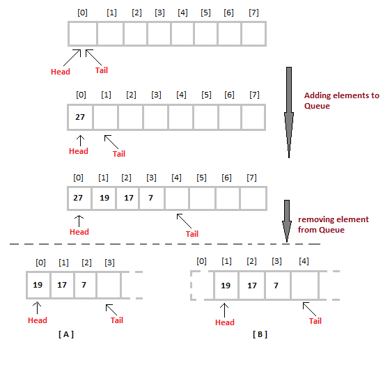

When we remove an element from Queue, we can follow two possible approaches (mentioned [A] and [B] in above diagram). In [A] approach, we remove the element at head position, and then one by one shift all the other elements in forward position.

In approach [B] we remove the element from head position and then move head to the next position.

In approach [A] there is an overhead of shifting the elements one position forward every time we remove the first element.

In approach [B] there is no such overhead, but whenever we move head one position ahead, after removal of first element, the size on Queue is reduced by one space each time.


```C
#include <stdio.h>
#include <conio.h>

#define MAX 10

int intArray[MAX];
int front = 0;
int rear = 0;

int total =0;
void enqueue(int value){
   if(!isFull()){
      intArray[rear++] = value;
      total++;
   }else{
        printf("overflow ");
        exit(0);
   }
}
void travers(int array[]){
    for(int i = front; i < MAX; i++)
        printf("queue[%d] = %d \n", i, array[i]);
}

int dequeue(){
   int value = intArray[front++];
   total--;
   return value;
}

//utility function
int isFull(){
   return total == MAX ? 1 : 0;
}

int peek(){
   return intArray[front];
}

int isEmpty(){
   return total == 0 ? 1 : 0;
}

void main() {

   /* enqueue 5 items */
   enqueue(3);
   enqueue(5);
   enqueue(9);
   enqueue(1);
   enqueue(12);
   travers(intArray) ;

   int num = dequeue();
   printf("Element dequeue: %d\n",num);
   travers(intArray) ;

   getch();
}

```

Limitation of Array implementation

As you can see in the image below, after a bit of enqueueing and dequeueing, the size of the queue has been reduced.

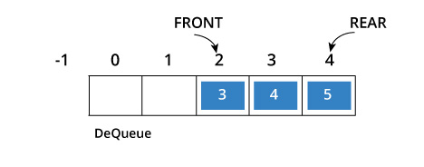

`Circular queue` avoids the wastage of space

https://www.programiz.com/dsa/circular-queue

Queue implement using link list (recommended way)

```C
#include<stdio.h>
#include<stdlib.h>
struct node
{
    int data;
    struct node *next;
};
struct node *front;
struct node *rear;
void enqueue();
void dequeue();
void travers();
void main() {
    int choice;
    while(choice != 4)
    {
        printf("\n*************************Main Menu*****************************\n");
        printf("\n=================================================================\n");
        printf("\n1.insert an element\n2.Delete an element\n3.Display the queue\n4.Exit\n");
        printf("\nEnter your choice ?");
        scanf("%d",&choice);
        switch(choice)
        {
            case 1:
            enqueue();
            break;
            case 2:
            dequeue();
            break;
            case 3:
            travers();
            break;
            case 4:
            exit(0);
            break;
            default:
            printf("\nEnter valid choice??\n");
        }
    }
   getch();
}
void enqueue(){
    struct node *ptr;
    int item;

    ptr = (struct node *) malloc (sizeof(struct node));
    if(ptr == NULL) {
        printf("\nOVERFLOW\n");
        return;
    }else {
        printf("\nEnter value?\n");
        scanf("%d",&item);

        ptr -> data = item;
        if(front == NULL){
            front = ptr;
            rear = ptr;
            front -> next = NULL;
            rear -> next = NULL;
        }else{
            rear -> next = ptr;
            rear = ptr;
            rear->next = NULL;
        }
    }
}

void dequeue(){
    struct node *ptr;
    if(front == NULL) {
        printf("\nUNDERFLOW\n");
        return;
    }else {
        ptr = front;
        front = front -> next;
        free(ptr);
    }
}
void travers()
{
    struct node *ptr;
    ptr = front;
    if(front == NULL)
        printf("\nEmpty queue\n");
    else{
        printf("\nprinting values .....\n");
        while(ptr != NULL)  {
            printf("\n%d\n",ptr -> data);
            ptr = ptr -> next;
        }
    }
}

```

### Applications of Queue ###

1. Queues are widely used as waiting lists for a single shared resource like printer, disk, CPU.
2. Queues are used in asynchronous transfer of data (where data is not being transferred at the same rate between two processes) for eg. pipes, file IO, sockets.
3. Queues are used as buffers in most of the applications like MP3 media player, CD player, etc.
4. Queue are used to maintain the play list in media players in order to add and remove the songs from the play-list.

### Standard problem of Queue ###

1. Breadth first searches for graph use queues
2. Level Order Tree Traversal
3. Reverse path of Binary tree
4. Construct Complete Binary Tree
5. Check whether a given Binary Tree is Complete or not 
6. Program for Page Replacement Algorithms | Set 2 (FIFO)
7. Number of siblings of a given Node in n-ary Tree
8. ZigZag Tree Traversal
9. Find the largest multiple of 3
10. Find maximum level sum in Binary Tree
Input :               4
                    /   \
                   2    -5
                  / \    /\
                -1   3 -2  6
Output: 6
Explanation :
Sum of all nodes of 0'th level is 4
Sum of all nodes of 1'th level is -3
Sum of all nodes of 0'th level is 6
Hence maximum sum is 6


### Deque ###
Deque is a generalized version of Queue data structure that allows insert and delete at both ends
Because of this property it is known as double ended queue(Deque)

Langauge support

1. C++'s Standard Template Library provides the class templates std::deque  for the multiple array
2. Java's Collections Framework provides a new `Deque` interface that provides the functionality of insertion and removal at both ends. It is implemented by classes such as ArrayDeque

###  Applications ###
One example where a deque can be used is the A-Steal job scheduling algorithm.[5] This algorithm implements task scheduling for several processors. A separate deque with threads to be executed is maintained for each processor. To execute the next thread, the processor gets the first element from the deque (using the "remove first element" deque operation). If the current thread forks, it is put back to the front of the deque ("insert element at front") and a new thread is executed. When one of the processors finishes execution of its own threads (i.e. its deque is empty), it can "steal" a thread from another processor: it gets the last element from the deque of another processor ("remove last element") and executes it. The steal-job scheduling algorithm is used by Intel's Threading Building Blocks (TBB) library for parallel programming.

### Priority queue ###
[Link](https://en.wikipedia.org/wiki/Priority_queue)

### Graph Data structure ###
We know Array and Linked List, which are linear data structures but always it is not possible to used connected data/sophistcated things e.g map of roads, 
 google map, airline flights from city to city, how the Internet is connected,   On facebook, everything is a graph(That includes User, Photo, Album, Event, Group, Page, Comment, Story, Video, Link,who knows whom,
who communicates with whom, who influences whom or other relationships),computer networks,Google map
,Friendship relation {(Alice, Bob), (Bob, Alice), (Bob, Michel), (Michel, Bob),
(Josefa, Michel), (Michel, Josefa)}  

For such case we need graph data structure(Non lenear data structure)

Graph is a collection graph vertices(node) and edges

Note : edges is used to connect vertices


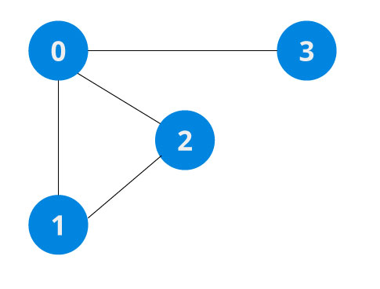

In the above graph,

V = {0, 1, 2, 3}
E = {(0,1), (0,2), (0,3), (1,2)}

### Graph Terminology ###
1. Adjacency: A vertex is said to be adjacent to another vertex if there is an edge connecting them.

In above picutre <br/>
v(0,1) is adjacent because there is  edge between them.<br/>
v(2,3) is adjacent because there is  edge between them.

### Tree Data structure ###
Tree is a special kind of graph that is used to store information that naturally forms a hierarchy(each node can be connected to multiple nodes). For example, the file system on a computer:


Terminology used in trees:

1.Root : The top node in a tree.
2. Child: A node directly connected to another node when moving away from the root.
3.Parent:The converse notion of a child.
4.Siblings:A group of nodes with the same parent.
5.Descendant:A node reachable by repeated proceeding from parent to child. Also known as subchild.
6.Ancestor:A node reachable by repeated proceeding from child to parent.
7.Leaf:A node with no children.

8.Degree:For a given node, its number of children. A leaf is necessarily degree zero.
9.Edge:The connection between one node and another.
10.Path:A sequence of nodes and edges connecting a node with a descendant.
11.Level:The level of a node is defined as: 1 + the number of edges between the node and the root.
12.Height of node:The height of a node is the number of edges on the longest path between that node and a leaf.
13.Height of tree:The height of a tree is the height of its root node.
14.Depth:The depth of a node is the number of edges from the tree's root node to the node.

### Some properties of Tree ###
1. One way direction : Tree travers should be root to leaf . 
2. No cycle : Node can't connected such a way that can't create cycle or loop.
3. Every child must have only one parent:
4. Recursive Data Structure: tree recursively contain another tree that contais data
5. Number of Edges is N-1 : if a tree have n th node then edge must be n-1

Applications of Trees
Trees and their variants are an extremely useful data structure with lots of practical applications.


1. Heap tree  is used for heifz used in modern routers to store routing information.
2. Most popular databases use B-Trees, B+ tree and T-Trees  to implement indexing
3. Compilers use a syntax tree to validate the syntax of every program you write.
3. BST tree is used quicker search than Linked List
  note : it will slower than array
4. BST tree is used quicker insert/delete than array but slower than Unordered Linked Lists
5. K-D Tree: A space partitioning tree used to organize points in K dimensional space.
6. Trie : Used to implement dictionaries with prefix lookup.
7. Suffix Tree : For quick pattern searching in a fixed text.

Linear data structures like arrays, stacks, queues and linked list have only one way to read the data. But a hierarchical data structure like a tree can be traversed in three different ways.
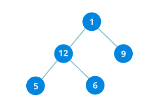


1.Inorder traversal : 
Until all nodes are traversed −
  1.First, visit all the nodes in the left subtree
  2.Then the root node
  3.Visit all the nodes in the right subtree

  Let's put all this in a stack so that we remember.

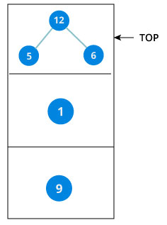

  Now we traverse to the subtree pointed on the TOP of the stack.Again, we follow the same rule of inorder

Left subtree -> root -> right subtree

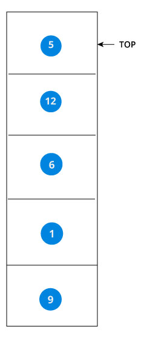

Since the node "5" doesn't have any subtrees, pop from stack

5 -> 12 -> 6 -> 1 -> 9

2.Preorder traversal
Until all nodes are traversed 
Visit root node
Visit all the nodes in the left subtree
Visit all the nodes in the right subtree

1 ->12 ->5 ->6 ->9 ->    

3.Postorder traversal
Until all nodes are traversed 
visit all the nodes in the left subtree
visit the root node
visit all the nodes in the right subtree

5 ->6 ->12 ->9 ->1 ->

Example 2 :


in-order : D → B → E → A → F → C → G
Pre-order :A → B → D → E → C → F → G

Post-order : D → E → B → F → G → C → A


see implemnetation on binary search tree


### types-of-tree ###
3. Binary Tree :
Binary Tree is a special type of generic tree in which, each node can have at most two children. Binary tree is generally partitioned into three disjoint subsets.

  1. Root of the node
  2. left sub-tree which is also a binary tree.
  3. Right sub-tree which is also a binary tree.


Application of Binary Tree:
Searching in Binary tree become faster.
Binary tree provides six traversals.
Two of six traversals give sorted order of elements.
Maximum and minimum elements can be directly picked up.
It is used for graph traversal and to convert an expression to postfix and prefix forms.
### Properties of Binary Tree: ###

1) The maximum number of nodes at level 'l' of a binary tree is 2<sup>l</sup>-1. Here level is number of nodes on path from root to the node (including root and node). Level of root is 1. 
2) Maximum number of nodes in a binary tree of height 'h' is 2<sup>h</sup> – 1.
3.In a Binary Tree with N nodes, minimum possible height or minimum number of levels is  ⌈ Log2(N+1) ⌉
4. A Binary Tree with L leaves has at least   ⌈ Log2L ⌉ + 1   levels   
 5.In Binary tree where every node has 0 or 2 children, number of leaf nodes is always one more than nodes with two children.

Types of Binary Tree:

  1. Strictly Binary Tree:
  Every non-leaf node contain non-empty left and right sub-trees

  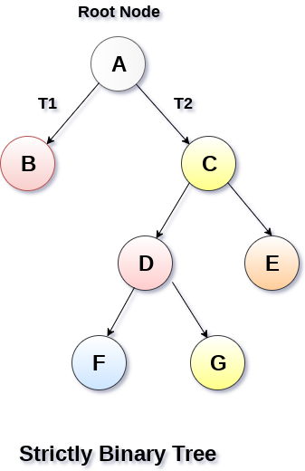

  2. Complete Binary Tree: 

  A Binary Tree is complete Binary Tree if all levels are completely filled except possibly the last level and the last level has all keys as left as possible

  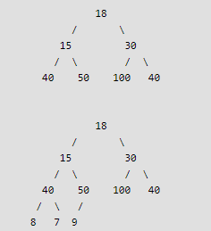

  2. Perfect Binary Tree:  where all nodes have two children and all leaves are at same level

  2. Balance binary tree : A binary tree is balance if height of the tree is O(Long n) where n= no of nodes. example avl , red black tree

4. Binary Search Tree :
 binary search tree is a special binary tree is that following The properties

  1. All nodes of left subtree are less than root node
  2. All nodes of right subtree are more than root node
  3. Both subtrees of each node are also BSTs i.e. they have the above two properties

It is called a search tree because it can be used to search for the presence of a number in O(log(n)) time.  
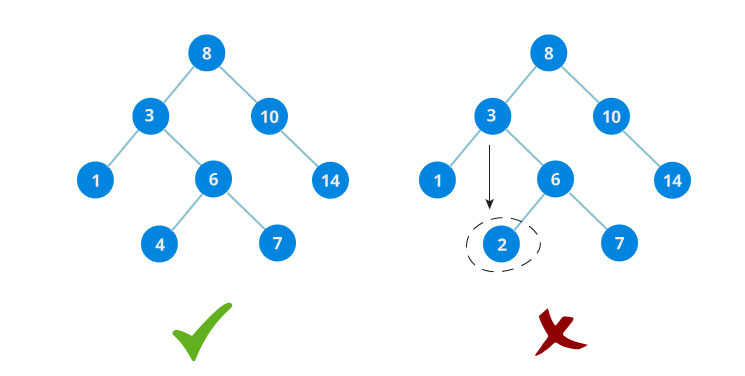

The binary tree on the right isn't a binary search tree because the right subtree of the node "3" contains a value smaller that it.

  Advantages of using binary search tree :

  Searching become very efficient in a binary search tree since, we get a hint at each step, about which sub-tree contains the desired element.
  The binary search tree is considered as efficient data structure in compare to arrays and linked lists. In searching process, it removes half sub-tree at every step. Searching for an element in a binary search tree takes o(log2n) time. In worst case, the time it takes to search an element is 0(n).
  It also speed up the insertion and deletion operations as compare to that in array and linked list.

Insert  Operations
1. Start searching from the root node,it is null then place it as root
2. Start searching from the root node, then if the data is less than the key value, search for the empty location in the left subtree and insert the data. 
3. Otherwise, search for the empty location in the right subtree and insert the 

For example : 43, 10, 79, 90, 12, 54, 11, 9, 50

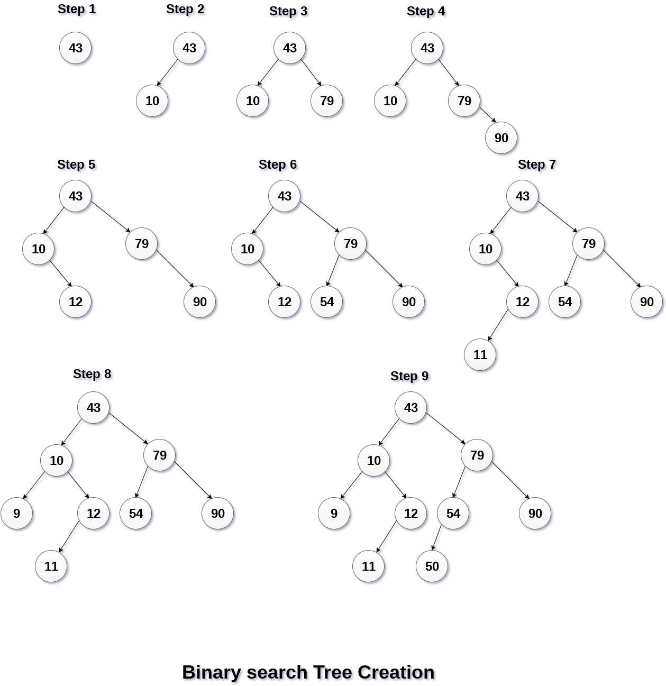

```C
#include<stdio.h>
#include<stdlib.h>
  
struct node
{
    int data;
    struct node* left;
    struct node* right;
};

struct node* createNode(value){
    struct node* newNode = malloc(sizeof(struct node));
    newNode->data = value;
    newNode->left = NULL;
    newNode->right = NULL;

    return newNode;
}
  
  
struct node* insert(struct node* root, int data)
{
    if (root == NULL) return createNode(data);

    if (data < root->data)
        root->left  = insert(root->left, data);
    else if (data > root->data)
        root->right = insert(root->right, data);   
 
    return root;
}


int main(){
    struct node *root = NULL;
    root = insert(root, 8);
    insert(root, 43);
    insert(root, 10);
    insert(root, 79);
    insert(root, 90);
    insert(root, 12);
    insert(root, 54);
    insert(root, 4);
    insert(root, 9);
    insert(root, 50);
}
```
Search Operation : similar way to insert operation


1.start searching from the root node. Then if the data is less than the key value, search for the element in the left subtree. 
2. Otherwise, search for the element in the right subtree. 
3. Follow the same algorithm for each node.


```C
struct node* search(struct node* root,int data){
   struct node *current = root;
   printf("Visiting elements: ");

   while(current->data != data){

      if(current != NULL) {
         printf("%d ",current->data);

         //go to left tree
         if(current->data > data){
            current = current->left;
         }  //else go to right tree
         else {
            current = current->right;
         }

         //not found
         if(current == NULL){
            return NULL;
         }
      }
   }

   return current;
}
```

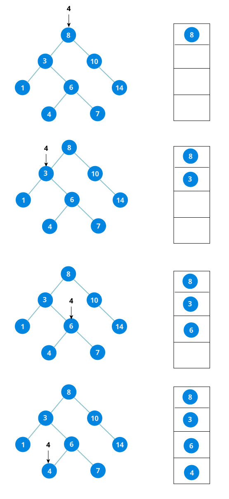


Traversing operation

```C
void inorder(struct node* root){
    if(root == NULL) return;
    inorder(root->left);
    printf("%d ->", root->data);
    inorder(root->right);
}

void preorder(struct node* root){
    if(root == NULL) return;
    printf("%d ->", root->data);
    preorder(root->left);
    preorder(root->right);
}

void postorder(struct node* root) {
    if(root == NULL) return;
    postorder(root->left);
    postorder(root->right);
    printf("%d ->", root->data);
}
```

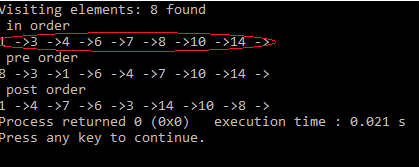

we noticed that(red symbol) The inorder traversal of a Binary Search Tree(BST) is a sorted list of numbers! !!

AVL Tree : 


search 7

complexity: O(h)    h = log(n) where n = number of element on bst/bt

here O(4)

element 10, but comparisom  required 4 

but  
In real-time data, we cannot predict data pattern and their frequencies so it can be following binary search tree 
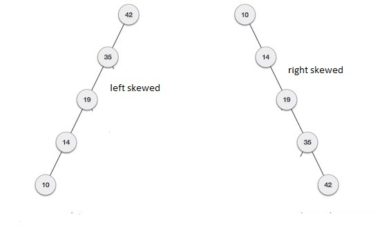

search 10

complexity: O(n)     where n = number of element 

here every element need compare

we need to limit the skewnees(balancing) of bst to speed up search operation

Balance Factor of any node = height(left-sutree) − height(right-sutree)
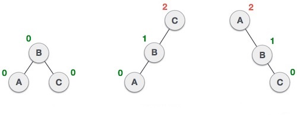
1st picture 
B node balance factor = 1-1 = 0
A node balance factor = 0-0 = 0
C node balance factor = 0-0 = 0

2nd picture
C node balance factor = 2-0 = 2
B node balance factor = 1-0 = 1
A node balance factor = 0-0 = 0


3nd picture
A node balance factor = 0-2 = -2
B node balance factor = 0-1 = -1
A node balance factor = 0-0 = 0

Named after their inventor Adelson, Velski & Landis(AVL tree) is a bst that the balance factore of any node is either 1 or 0 or -1 then it is considered balanced

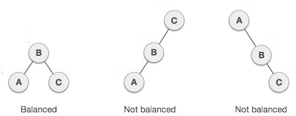

A node with any other balance factor is considered unbalanced(Not avl tree) and requires rebalancing the tree/ convert to avl tree.

To rebalancing , an unbalanced tree may perform the following four kinds of rotations techniques −

Left rotation : if a node is inserted into the right subtree of the right subtree(LL)
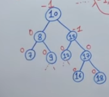

insert 18,19


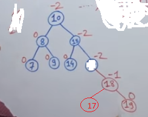

Right rotation :  if a node is inserted in the left subtree of the left subtree(RR)


Insert 6
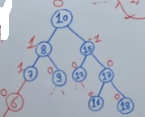

Insert 4
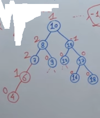
Now it is not balanced since it have node 7, 8 imbalance node(since have balance factore =2)

we have to go from leaf node . node 4 blance, node 6 balance node 7 imbalance

since if 7 node is inserted in the left subtree( 6) of the left subtree( 4) . we rotate right (Pull then becommes figure)as a result it becomes balance bst(right side grater value, left side less value)


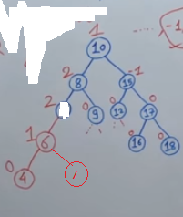


Left-Right rotation:


insert 2,3
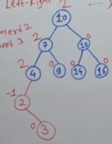

Method 1 :

2<3<4

so 3 is root , 4 right, 2 left

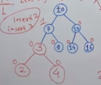

Method 2 : 
Example:

1. Do Right rotation
For Right rotation we need two RR but here one so we consider b have right child(imagine) . 
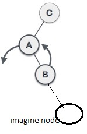


1. Do Left rotation


Right-Left rotation :


insert 18,17
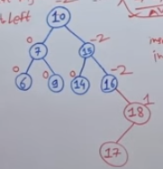

Example:

1. Do Left rotation
For Left rotation we need two LL but here one so we consider b have left child(imagine) . 
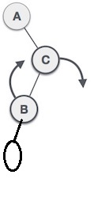


1. Do Right rotation


5. Expression Tree:
Expression trees are used to evaluate the simple arithmetic expressions. Expression tree is basically a binary tree where internal nodes are represented by operators while the leaf nodes are represented by operands. Expression trees are widely used to solve algebraic expressions like (a+b)*(a-b). Consider the following example.

Q. Construct an expression tree by using the following algebraic expression.

(a + b) / (a*b - c) + d


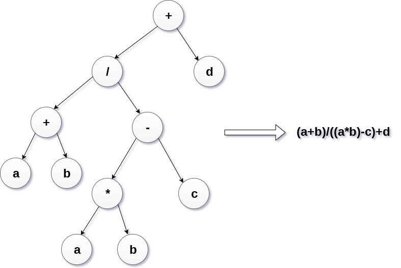

6. Tournament Tree
Tournament tree are used to record the winner of the match in each round being played between two players. Tournament tree can also be called as selection tree or winner tree. External nodes represent the players among which a match is being played while the internal nodes represent the winner of the match played. At the top most level, the winner of the tournament is present as the root node of the tree.

For example, tree .of a chess tournament being played among 4 players is shown as follows. However, the winner in the left sub-tree will play against the winner of right sub-tree.

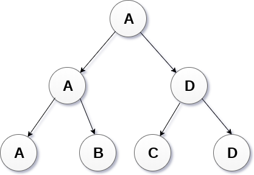


A special pointer called ROOT points to the node that is the parent of all the other nodes.

Also, the nodes that don't have any children have their left and right pointers point to NULL.

```C
#include <stdio.h>
#include <stdlib.h>

struct node {
    int data;
    struct node* left;
    struct node* right;
};

struct node* createNode(value){
    struct node* newNode = malloc(sizeof(struct node));
    newNode->data = value;
    newNode->left = NULL;
    newNode->right = NULL;

    return newNode;
}

struct node* insertLeft(struct node *root, int value) {
    root->left = createNode(value);
    return root->left;
} 


struct node* insertRight(struct node *root, int value){
    root->right = createNode(value);
    return root->right;
}

int main(){
    struct node *root = createNode(1);
    insertLeft(root, 2);
    insertRight(root, 3);
    
    printf("The elements of tree are %d %d %d", root->data, root->left->data, root->right->data);
}
```

Red Black tree : 
red–black tree is a kind of self-balancing binary search tree (similar to AVL tree)

Each node of the binary tree has an extra bit, and that bit is often interpreted as the color (red or black) of the node. These color bits are used to ensure the tree remains approximately balanced during insertions and deletions. as a result it need less rotation during insertion/deletion than avl tree
So red black tree is more prefer than avl tree

Example : TreeMap or sortedTreeMap in java
A red black tree must maintain the following colouring rules:
1. The root node must be black.null nodes are considered to be black.
2. No red-red parent-child(both parent-child can't be red one has be black)
3. Every path from root to null pointer must have exactly the same number of balck nodes

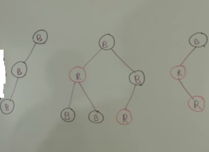

1st picure 
1.root is black condition 1 statisfy
2. no parent-child both red condition 2 satisfy
3. Number of black node from B to null path =1
Number of black node from B->B->null path=2
Number of black node from B->B->B>null path=3

nof of black nodes are not same so its does not satisfy 3rd condition . so it is not redblack tree <br>
2nd picure  : redblack tree<br/>

3rd picure  : redblack tree

### Insertion Algorithm ###
1. if empty tree create root(according to binary search tree insertion rules)
  1. if parent is black then you don't need to do anything.
  2. if parent is red then perform following
    1. if the sibling of the parent is black/missing, a rotation needs to be performed

   If the insertion path from grand parent to parent to node is straight 
   LL = Right rotation <br>
   RR = Left rotation <br>
   If it is angled (LR or RL) we need to do a double.
   LR = Right rotation + Left rotation<br>
   RL = Left rotation + Right rotation<br>

    2. if the sibling of the parent is red,  colour swap between parent+sibling and grandparent.

Insert 30

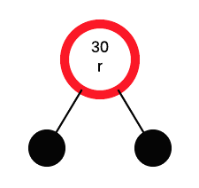

Note : we know null nodes are considered to be black.

If the root is red, make it black:

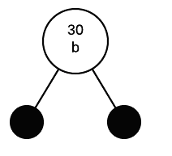

Insert 50

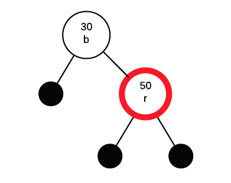

Since  parent is black so we don't have to change anything

Insert 40

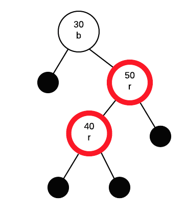

Since parent is red, we must apply fix. Parent's sibling (50's sibling) is black, so we must perform a rotation.


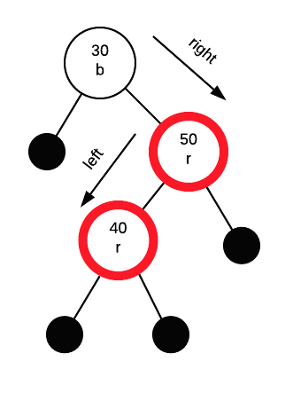

Since insertion path is RL so need Left rotation + Right rotation<br>

Now Left rotation (Rotate first 40 and 50)
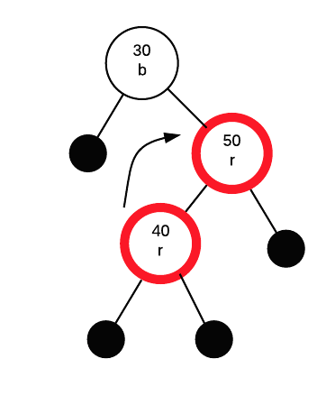

It becomes

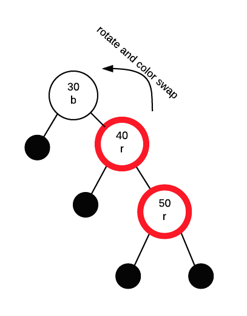

Now Right rotation (Rotate  30 and 40)

It becomes

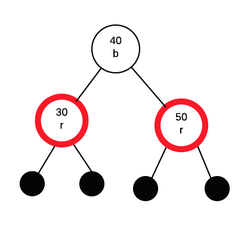

40's colour red and it is red . so just change it  to black


Insert 20

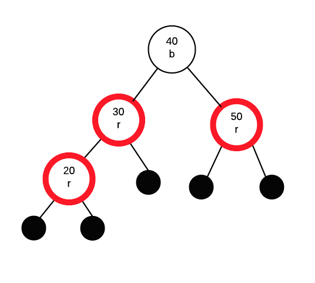

If parent is red we must apply a fix. Parent's sibling is red so we need to do a colour swap between parent+sibling and grandparent

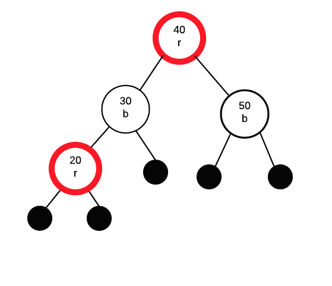

40's colour red and it is red . so just change it  to black

Insert 10

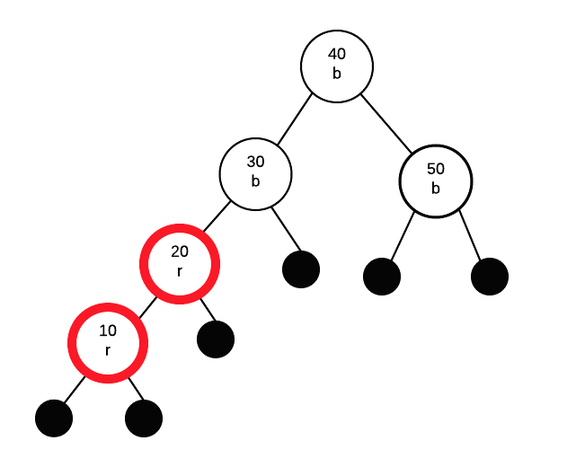

If parent is red, we must apply a fix. Parent's sibling is black, so a rotation is needed. This time, the insertion path from grandparent to parent to node is "left" then "left". Thus, we only need to perform a single rotation and colour swap.

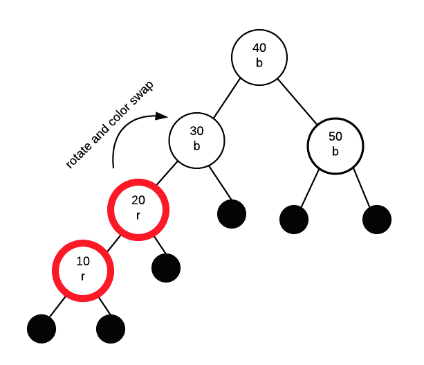

Final output

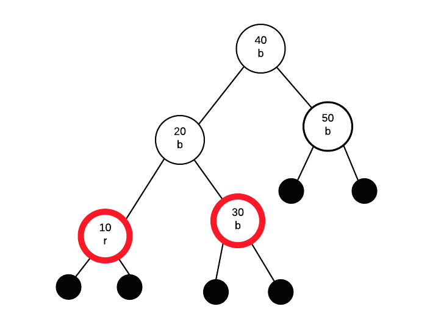

https://www.youtube.com/watch?v=UaLIHuR1t8Q

### Heap ###
Heap is a special case of binary tree data structure that have following property
1. it is balanced(complete) tree. This property  makes them suitable to be stored in an array.
2. it is either Min Heap or Max Heap
  1. Min Heap : here the value of the root node is less than or equal to either of its children.

  

  2. Max-Heap : Where the value of the root node is greater than or equal to either of its children.

  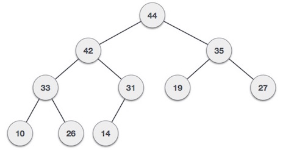

The traversal method use to achieve Array representation is Level Order
  

Max Heap Construction Algorithm

Step 1 − Create a new node at the end of heap.
Step 2 − Assign new value to the node.
Step 3 − Compare the value of this child node with its parent.
Step 4 − If value of parent is less than child, then swap them.
Step 5 − Repeat step 3 & 4 until Max Heap property holds.

Note : In Min Heap construction algorithm, Step 4 : If value of parent is greater than child, then swap them.
For Example → 12 7 6 10 8 20 

take 12 and 7
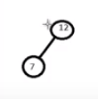

since 12 > 7 No swap

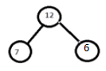

since 12 > 6 No swap

take 10

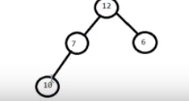

since 7 > 10  swap them 


take 8

since 10 > 8 No swap

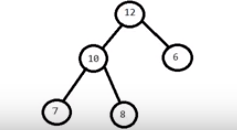

take 8

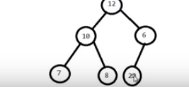

since 20 > 6  swap them 
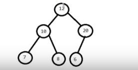

since 20 > 12 swap them 


### Max Heap Deletion Algorithm ###


Step 1 − Remove deleted root node.
Step 2 − Move the last element of last level to deleted root.
Step 3 − Compare the value of this child node with its parent.
Step 4 − If value of parent is less than child, then swap them.
Step 5 − Repeat step 3 & 4 until Heap property holds.

Note : In Min Heap deletion algorithm, Step 4 : If value of parent is greater than child, then swap them.


1.Remove deleted root node.


Step 2 − Move the last element of last level to root. In this case it is 21


Now it is not a heap. we need this to heap again

since 21 > 1 No swap

Compare the values of the replacement node(21)  with all its children nodes in the tree:
Swap the replacement node with the smallest of the children nodes .In this case it is 9


Compare the values of the replacement node (21) with all its children nodes in the tree:
Swap the replacement node with the smallest of the children nodes:In this case it is 17


The replacement node (21) does not have any children node: that means it is convert to heap

### Heap sort ###

### Application Heap ###

1.To quickly find the smallest and largest element from a collection of items or array.
3. In order to overcome the Worst Case Complexity of Quick Sort algorithm from O(n^2) to O( nlog(n) ) in Heap Sort.
4. Priority queues can be efficiently implemented using Binary Heap because it supports insert(), delete() and extractmax(), decreaseKey() operations in O(logn) time. Binomoial Heap and Fibonacci Heap are variations of Binary Heap.

Note : priority queues are used in Graph algorithms like Prim’s Algorithm and Dijkstra’s algorithm.and Huffman encoding (data compression)

4. merge k sorted array
5.sort an almost sorted array

### Hash Table Data structure ###

Suppose we want to design a system for storing employee records keyed using phone numbers. And we want following queries to be performed efficiently:

Insert a phone number and corresponding information.
Search a phone number and fetch the information.
Delete a phone number and related information.
We can think of using the following data structures to maintain information about different phone numbers.

1. Array/Linked of phone numbers and records.
For arrays and linked lists, we need to search in a linear fashion, which can be costly in practice
we can't consider it
3. Balanced binary search tree with phone numbers as keys.
here we get moderate search, insert and delete times. All of these operations can be guaranteed to be in O(Logn) time.
4. Direct Access Table.
Using direct access table where we make a big array and use phone numbers as index in the array
An entry in array is NIL if phone number is not present, else the array entry stores pointer to records corresponding to phone number. Time complexity wise this solution is the best among all, we can do all operations in O(1) time.but it have some limitation
1. extra space required is huge.For example if phone number is n digits, we need O(m * 10n) space for table where m is size of a pointer to record
2.  Another problem is an integer in a programming language may not store n digits.

Due to above limitations Direct Access Table cannot always be used. Hash Table is the solution that can be used in almost all such situations and performs extremely well compared to above data structures like Array, Linked List, Balanced BST in practice. With hashing we get O(1) search time on average (under reasonable assumptions) and O(n) in worst case.

Hash Function: a hash function maps a big number or string to a small integer that can be used as index in hash table.
A good hash function should have following properties
1) Efficiently computable.
2) Should uniformly distribute the keys 

Collision Handling: Since a hash function gets us a small number for a big key, there is possibility that two keys result in same value
Following are the ways to handle collisions:

1. Chaining:The idea is to make each cell of hash table point to a linked list of records that have same hash function value. Chaining is simple, but requires additional memory outside the table.
2. Open Addressing: In open addressing, all elements are stored in the hash table itself. Each table entry contains either a record or NIL. When searching for an element, we one by one examine table slots until the desired element is found or it is clear that the element is not in the table.
3. Linear Probing : In linear probing, search the next empty location in the array by looking into the next cell until we find an empty cell


As we can see above, 2 index comming duplicaion that means happend hash Collision 

Sovle using Linear Probing technique


Consider hash table data struncure of size 20 with the following values


Basic Operations
Following are the basic primary operations of a hash table.

Search − Searches an element in a hash table.

Insert − inserts an element in a hash table.

delete − Deletes an element from a hash table.


```C
#include <stdio.h>
#include <string.h>
#include <stdlib.h>
#include <stdbool.h>

#define SIZE 20

struct DataItem {
   int data;   
   int key;
};

struct DataItem* hashArray[SIZE]; 
struct DataItem* dummyItem;
struct DataItem* item;

int hashCode(int key) {
   return key % SIZE;
}

struct DataItem *search(int key) {
   //get the hash 
   int hashIndex = hashCode(key);  
  
   //move in array until an empty 
   while(hashArray[hashIndex] != NULL) {
  
      if(hashArray[hashIndex]->key == key)
         return hashArray[hashIndex]; 
      
      //go to next cell
      ++hashIndex;
    
      //wrap around the table
      hashIndex %= SIZE;
   }        
  
   return NULL;        
}

void insert(int key,int data) {

   struct DataItem *item = (struct DataItem*) malloc(sizeof(struct DataItem));
   item->data = data;  
   item->key = key;

   //get the hash 
   int hashIndex = hashCode(key);

   //move in array until an empty or deleted cell
   while(hashArray[hashIndex] != NULL && hashArray[hashIndex]->key != -1) {
      //go to next cell
      ++hashIndex;
    
      //wrap around the table
      hashIndex %= SIZE;
   }
  
   hashArray[hashIndex] = item;
}

struct DataItem* delete(struct DataItem* item) {
   int key = item->key;

   //get the hash 
   int hashIndex = hashCode(key);

   //move in array until an empty
   while(hashArray[hashIndex] != NULL) {
  
      if(hashArray[hashIndex]->key == key) {
         struct DataItem* temp = hashArray[hashIndex]; 
      
         //assign a dummy item at deleted position
         hashArray[hashIndex] = dummyItem; 
         return temp;
      }
    
      //go to next cell
      ++hashIndex;
    
      //wrap around the table
      hashIndex %= SIZE;
   }      
  
   return NULL;        
}

void display() {
   int i = 0;
  
   for(i = 0; i<SIZE; i++) {
  
      if(hashArray[i] != NULL)
         printf(" (%d,%d)",hashArray[i]->key,hashArray[i]->data);
      else
         printf(" ~~ ");
   }
  
   printf("\n");
}

int main() {
   dummyItem = (struct DataItem*) malloc(sizeof(struct DataItem));
   dummyItem->data = -1;  
   dummyItem->key = -1; 

   insert(1, 20);
   insert(2, 70);
   insert(42, 80);
   insert(4, 25);
   insert(12, 44);
   insert(14, 32);
   insert(17, 11);
   insert(13, 78);
   insert(37, 97);

   display();
   item = search(37);

   if(item != NULL) {
      printf("Element found: %d\n", item->data);
   } else {
      printf("Element not found\n");
   }

   delete(item);
   item = search(37);

   if(item != NULL) {
      printf("Element found: %d\n", item->data);
   } else {
      printf("Element not found\n");
   }
}
```


### Linear Searching ###

Linear search is a very simple search algorithm.Every items is checked and if a match founds then that particular item.it is slow since every element need to check.

```C
#include <stdio.h>
#include <conio.h>

int linear_search(int arr[],int size,int searchitem);

void main() {

    int arr[20], n, i,item;
    printf("Enter the size of the array\n");
    scanf("%d", &n);

    printf("Enter %d the elements\n",n);
    for(i = 0; i < n; i++)
        scanf("%d", &arr[i]);
    
    //display data
    printf("Data : [ ");
    for(i = 0; i < n; i++){
      printf("%d ",arr[i]);
    }
    printf("]\n");

    //input search item
    printf("enter search number:\n");
    scanf("%d", &item);
    if(linear_search(arr,n,item) == 1)
      printf("found");
    else
      printf("Not found");

    getch();

}

int linear_search(int arr[],int size,int searchitem){
    int i;
    for(i = 0; i < size; i++) //number of iternation need for linear
         if(arr[i] == searchitem)
             return 1;
  
  return 0;  
}

```
### Binary Searching ###

Binary search is a fast search algorithm.
 [Alogrithm](http://www.tutorialspoint.com/data_structures_algorithms/binary_search_algorithm.htm).

 ```C
#include <stdio.h>
#include <conio.h>

int binary_search(int arr[],int size,int searchitem);

void main() {

    int arr[20], n, i,item;
    printf("Enter the size of the array\n");
    scanf("%d", &n);

    printf("Enter %d the elements\n",n);
    for(i = 0; i < n; i++)
        scanf("%d", &arr[i]);
    
    //display data
    printf("Data : [ ");
    for(i = 0; i < n; i++){
      printf("%d ",arr[i]);
    }
    printf("]\n");

    //input search item
    printf("enter search number:\n");
    scanf("%d", &item);
    if(binary_search(arr,n,item) == 1)
      printf("found");
    else
      printf("Not found");

    getch();

}

int binary_search(int arr[],int size,int searchitem){
    /*
    low,mid,high = store array index
    isFound = flag for search found or not
    */
    int low,mid,high,isFound = 0;
    
    //high is less then 1 than size 
    high = size - 1;

    //otherwise search done
    while(low <= high){
        mid = (low + high) / 2;
        //if midlle index found
        if(arr[mid] == searchitem){
            isFound = 1;
            break;
         }else if(searchitem < arr[mid])
            high = mid - 1;
        else
            low = mid + 1;
    }
  return isFound;  
}

 ```

### Sorting ###

Sorting refers to arranging data in a particular format in accending or decending.Importance of sorting lies in the fact that data searching can be optimized to a very high level if data is stored in a sorted manner.

### Bubble Sort ###

```C
#include <stdio.h>
#include <conio.h>
#include <string.h>

void main(){
	int n,a[20],i,j,temp;

    printf("Enter total numbers of elements: ");
    scanf("%d",&n);

    printf("Enter %d elements: ",n);
    // take value from user
    for(i = 0; i < n; i++){
      scanf("%d",&a[i]);
    }
    printf("Before sort : [ ");
    // input array value
    for(i = 0; i < n; i++){
      printf("%d ",a[i]);
    }
    printf("]");
    // input array value
    for(i = 0; i < n; i++){ //number of iternation need for bubble up
    	 for(j = 0; j < n-i; j++){ //n-i for performance you can use n
    	 	/*
    	 	for decending order : pickup greater value for bubble up
    	 	for accending order : pickup smaller value for bubble up then use <
    	 	*/
    	 	if(a[j] > a[j+1]){
    	 		temp = a[j]; // for swaping purpose
    	 		a[j] = a[j+1]; // bubble up
    	 		a[j+1] = temp; // swap
    	 	}
    	 }
    }
    printf("After sort : [ ");
    for(i = 0; i < n; i++){
      printf("%d ",a[i]);
    }
    printf("]");
}
```


### Quick Sort ###
 [Alogrithm](http://www.tutorialspoint.com/data_structures_algorithms/quick_sort_algorithm.htm).

 ```C
#include <stdio.h>
#include <conio.h>
#include <math.h>

void main(){
    /*
    arr = store elements that needs to sort using quick
    n = store no of elements
    i = store index value
    */
    int arr[20], n, i;
    printf("Enter the size of the array\n");
    scanf("%d", &n);

    printf("Enter the elements to be sorted\n");
    for(i = 0; i < n; i++)
        scanf("%d", &arr[i]);

    quicksort(arr, 0, n-1);

    printf("sorted : ");
    for(i = 0; i < n; i++)
        printf("%d ", arr[i]);
}
quicksort(int *arr, int low, int high){
    /*
    pivot = store pivot element
    temp = for swaping
    i,j = store index value
    */
    int pivot, i, j, temp;

    //if equal or more quick sort done
    if(low < high) {
        pivot = low; // select a pivot element,you can choose any one
        i = low;
        j = high;

        // increment i till you get a number 
        //greater from left side than the pivot element
        while(arr[i] <= arr[pivot] && i <= high)
            i++;
        // decrement j till you get a number 
        //from right side less than the pivot element
        while(arr[j] > arr[pivot] && j >= low)
            j--;
        //if equal or more quick sort done
        if(i < j) {
            temp = arr[i];
            arr[i] = arr[j];
            arr[j] = temp;
        }
        // when i >= j it means the j-th position is the correct position
        // of the pivot element, hence swap the pivot element with the
        // element in the j-th position
        temp = arr[j];
        arr[j] = arr[pivot];
        arr[pivot] = temp;

        // Repeat quicksort for the two sub-arrays, one to the left of j
        // and one to the right of j
        quicksort(arr, low, j-1);
        quicksort(arr, j+1, high);
    }   
}
```

### Merge Sort ###
 [Alogrithm](http://www.tutorialspoint.com/data_structures_algorithms/merge_sort_algorithm.htm).
 
```C
#include <stdio.h>
#include <conio.h>
#include <math.h>
#define MAX 50

void mergeSort(int arr[],int low,int mid,int high);
void partition(int arr[],int low,int high);

void main(){
  /*
  arr = store elements that needs to sort using quick
  n = store no of elements
  i = store index value
  */
  int arr[MAX], n, i;
    printf("Enter the size of the array\n");
    scanf("%d", &n);

    printf("Enter the elements to be sorted\n");
    for(i = 0; i < n; i++)
      scanf("%d", &arr[i]);

    partition(arr, 0, n-1);
    
    printf("sorted : ");
    for(i = 0; i < n; i++)
      printf("%d ", arr[i]);
}
void partition(int arr[],int low,int high){

    int mid;

    if(low<high){
         mid=(low+high)/2;

         partition(arr,low,mid);
         partition(arr,mid+1,high);

         mergeSort(arr,low,mid,high);
    }
}
void mergeSort(int arr[],int low,int mid,int high){
    int i,m,k,l,temp[MAX];
    l=low;
    i=low;
    m=mid+1;
    while((l<=mid)&&(m<=high)){
      if(arr[l]<=arr[m]){
             temp[i]=arr[l];
             l++;
         }
         else{
             temp[i]=arr[m];
             m++;
         }
         i++;
    }
    if(l>mid){
         for(k=m;k<=high;k++){
             temp[i]=arr[k];
             i++;
         }
    }
    else{
         for(k=l;k<=mid;k++){
             temp[i]=arr[k];
             i++;
         }
    }
   
    for(k=low;k<=high;k++){
         arr[k]=temp[k];
    }

}
```

Referece

[git](https://introcs.cs.princeton.edu/java/43stack/)
