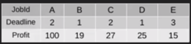
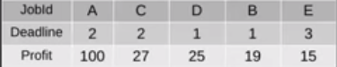
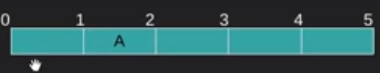
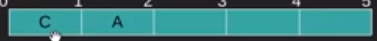
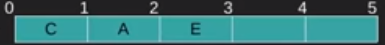
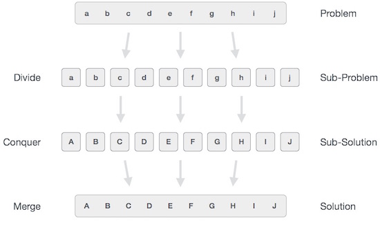
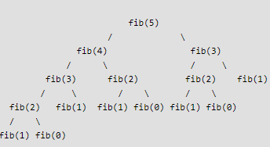
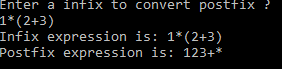

### Data Structure ###
Data Structure is a way to organized data in such a way that it can be used efficiently.Almost every enterprise application uses various types of data structures e.g array,linked list

### Data Structure Type ###
1. Built-in
    - Integers
    - Boolean (true, false)
    - Floating (Decimal numbers)
    - Character and Strings
2. Derived 
   - Array
   - Linked List
   - Stack
   - Queue
   - Tree
   - Graph
   - much more

### Algorithm ###
An algorithm is a procedure having well defined steps for solving a particular problem

The major categories of algorithms are given below:
1. Sort Algorithm: Sorting the items inside a data structure either acending or decending.
2. Search Algorithm : Searching the items inside a data structure.
3. Delete Algorithm : Delere the items from a data structure.
4. Insert Algorithm :  Inserting an item inside a data structure.
4. Update Algorithm :  Updating an item inside a data structure.

### Characteristics of an Algorithm ###

1. Input: An algorithm must have 0 or well defined inputs.
2. Output: An algorithm must have 1 or well defined outputs, and should match with the desired output.
3. Feasibility: An algorithm must be terminated after the finite number of steps.
4. Independent: An algorithm must have step-by-step directions which is independent of any programming code.
5. Unambiguous: An algorithm must be unambiguous and clear. Each of their steps and input/outputs must be clear and lead to only one meaning.

### Algorithm Complexity ###
The complexity of an algorithm gives the running time and/or the storage space required by the algorithm in terms of the size of input data.

1. Space Complexity :
Space complexity of an algorithm represents the amount of memory space required by the algorithm in its life cycle. The space required by an algorithm is equal to the sum of the following two components −

  - Fixed part:  it is a space required to store certain data and variables, that are independent of the size of the problem. For example, simple variables and constants used, program size, etc.

  - variable part : it is a space required by variables, whose size depends on the size of the problem. For example, dynamic memory allocation, recursion stack space, etc.

  <table class="table table-bordered">
  <tbody><tr><th>Type</th><th>Size</th></tr>
  <tr><td>bool, char, unsigned char, signed char, __int8</td><td>1 byte</td></tr>
  <tr><td>__int16, short, unsigned short, wchar_t, __wchar_t</td><td>2 bytes</td></tr>
  <tr><td>float, __int32, int, unsigned int, long, unsigned long</td><td>4 bytes</td></tr>
  <tr><td>double, __int64, long double, long long</td><td>8 bytes</td></tr>
  </tbody></table>

  Concider following programm
  ```C
  {
    int z = a + b + c;
    return(z);
  }
  ```

  variables a, b, c and z are all integer types, hence they will take up 2 bytes each, so total memory requirement will be (8 + 2) = 10 bytes
  this additional 2 bytes is for return value. And because this space requirement is fixed
  hence it is called Constant Space Complexity.

  ```C
  // n is the length of array a[]
  int sum(int a[], int n)
  {
    int x = 0;    // 2 bytes for x
    for(int i = 0; i < n; i++)  // 2 bytes for i
    { 
        x  = x + a[i];    
    }
    return(x);
  }
  ```

  In the above code, 2*n bytes of space is required for the array a[] elements.
  2 bytes each for x, n, i and the return value.
  Hence the total memory requirement will be (2n + 8), which is increasing linearly with the increase in the input value n, hence it is called as Linear Space Complexity

2. Time Complexity :
Time complexity of an algorithm represents the amount of time required by the algorithm to run to completion
For example, addition of two n-bit integers takes n instuction. Consequently, the total computational time is T(n) = c ∗ n, where c is the time taken for the addition of two bits.

<b>Asymptotic(Asymptotic means approaching a value or curve arbitrarily closely) analysis</b> of an algorithm refers to defining the mathematical boundation/framing of its run-time performance in terms of input size.The time required by an algorithm falls under three types −

1. Best Case − Minimum time required for program execution. it express by nota
tion called Ω Notation
2. Average Case − Average time required for program execution.

3. Worst Case − Maximum time required for program execution.
it express by nota
tion called Ο(Big O) Notation

The other one asymptotic notations  is <br/>
θ Notation : it express both best case and worst case.

Consider flowing function

```C
int myFunction(int n)
{
   int x=n+10;
   x=x/2;
   return x;
}
```

Since any value of n it execute constant number of instruction . as a result it will always need same time. it express by O(1);

Consider floowing function
```C
int myFunction2(int n)
{
  int sum=0;
  for(int i=1;i<=n;i++)
  {
    sum+=i;
    if(sum>=1000) break;
  }
  return sum;
}
```

Since based on value of n number of instruction increased . although it can break but we always concider worse case . it is expressed by O(n);

```C
int myFunction3(int n)
{
int sum=0;
for(int i=1;i<=n;i++)
{
for(int j=i;j<=n;j++)
{
sum+=(i+j);
}
}
return sum;
}
```
Since first loop is running n times, 2nd loop is running n-1 times,3rd loop running n-2 times <br />
so algorithm complexitity = n + n-2 + n-3+.....+1
                           = n * (n + 1)/2
                           = (n<sup>2</sup> + n)/2 
                           = n<sup>2</sup> (n<sup>2</sup> + n and n<sup>2</sup> is very little)
                           = O(n<sup>2</sup>)

```

int binary_search(int arr[],int size,int searchitem){
   int low,mid,high,isFound = 0;
   high = size - 1;
   while(low <= high){
       mid = (low + high) / 2;
       //if midlle index found
       if(arr[mid] == searchitem){
           isFound = 1;
           break;
        }else if(searchitem < arr[mid])
           high = mid - 1;
       else
           low = mid + 1;
   }
  return isFound;  
}
```

Since here every time n is divided 2 times. <br />
How many times a number can divided by two? <br />
Ans : log<sub>2</sub>n (n = a number)<br />
it is expressed by O(log<sub>2</sub>n)

if an algorithm have (n<sup>4</sup>) , (n<sup>2</sup>) and log<sub>2</sub>n<br />
then = (n<sup>4</sup>) + (n<sup>2</sup>) + log<sub>2</sub>n<br />
= (n<sup>4</sup>) (Since (n<sup>2</sup>) + log<sub>2</sub>n is very small)


### Algorithm Technique ###

1. Greedy approach : In greedy algorithm approach, decisions are made from the given solution domain. As being greedy, the closest solution that seems to provide an optimum solution is chosen  at that moment. But it may fail where global optimization

  Example : Counting Coins, we have coins of 1, 7, 10 value, How many coins are required to get 18 ?

  Ans : 3 coins.Greedy approach forces the algorithm to pick the largest to lowest possible coin.
  - 10, the remaining count is 7
  - 7, the remaining count is 1
  - 1


  if we slightly change the problem(Count 15) then the same approach may not be able to produce the same optimum result, then greedy approach may use more coins than necessary<br/>
  10 + 1 + 1+1+1+1+1+1(6 coins)
  <br />
  Whereas the same problem could be solved by using only 3 coins (7 + 7 + 1) . (it may fail where global optimization)

  ```
  int coin[3] = { 10, 5, 2,1 } ;
   int totalChange = 16, coinRequired = 0;
   // for i = 1 to total coin decensing  order
   for(int i = 0; i <= 3; i++){
      if(totalChange >= coin[i]){
          coinRequired ++;
          totalChange -= coin[i];
      }
   }
   printf("The required coins %d", coinRequired);
  ```

Most networking algorithms use the greedy approach. Here is a list of few of them −

1. Travelling Salesman Problem
2. Prim's Minimal Spanning Tree Algorithm
3. Kruskal's Minimal Spanning Tree Algorithm
4. Dijkstra's Minimal Spanning Tree Algorithm
5. Graph - Map Coloring
6. Graph - Vertex Cover
7. Knapsack Problem
8. Job Scheduling Problem :
9. Job Sequencing Problem :
  Given an array of jobs where every job has a deadline and associated profit if the job is finished before the deadline. It is also given that every job takes single unit of time, so the minimum possible deadline for any job is 1. <br />
  How to maximize total profit if only one job can be scheduled at a time ?

  In greedy approach,
  1) Sort all jobs in decreasing order of profit.
  2) Initialize the result sequence as first job in sorted jobs( place at Scheduling List).
  3) Do following for remaining n-1 jobs
  .......a) If the current job can fit in the current result sequence 
            without missing the deadline, add current job to the result.
            Else ignore the current job.

  For Example : <br />
  

  1) Sort all jobs in decreasing order of profit.

  

  2) Initialize the result sequence as first job in sorted jobs( place at Scheduling List).

  Since job A has deadline 2 unit so it could be place at 0-1 or 1-2 seconds. we choose always latest dealine  so we choose 1-2

  

  Next job C we start looking empty backward from unit 2. 0-1 is empty slot so c is there

  

  Next job D we start looking empty backward from unit 1. 0-1 is not empty slot so skip it

  Next job B we start looking empty backward from unit 1. 0-1 is not empty slot so skip it

  Next job E we start looking empty backward from unit 3. 2-3 is  empty slot so E is there

  

  ```
  //implement using C++
  #include<iostream>
  #include<algorithm>
  using namespace std;

  struct Job{
      char id;
      int deadline;
      int profit;
  };

  bool comparison(Job a, Job b)
  {
       return a.profit > b.profit;
  }

  void printJobScheduling(Job arr[], int n){
      sort(arr, arr+n, comparison);

       int result[n]; // To store result (Sequence of jobs)
       bool slot[n];

       // Initialize all slots to be free
      for (int i=0; i<n; i++)
          slot[i] = false;
      // Iterate through all given jobs
      for (int i=0; i<n; i++){
              //min(n, arr[i].deadline)-1; slot before or after based on deadline
          for (int j=min(n, arr[i].deadline)-1; j>=0; j--){
            // Free slot found
            if (slot[j]==false)
            {
               result[j] = i;  // Add this job to result
               slot[j] = true; // Make this slot occupied
               break;
            }
          }
      }

      // Print the result
      for (int i=0; i<n; i++)
         if (slot[i])
           cout << arr[result[i]].id << " ";
  }
  // Driver program to test methods
  int main()
  {
      Job arr[] = {
                      {'a', 2, 100},
                      {'b', 1, 19},
                      {'c', 2, 27},
                      {'d', 1, 25},
                      {'e', 3, 15}
                 };
      int n = sizeof(arr)/sizeof(arr[0]);
      cout << "Following is maximum profit sequence of job :" ;
      printJobScheduling(arr, n);
      return 0;
  }

  ```

2. `Divide and Conquer` :

  In divide and conquer approach, the problem in hand, is divided into smaller sub-problems and then each problem is solved independently. When we keep on dividing the subproblems into even smaller sub-problems, we may eventually reach a stage where no more division is possible. Those "atomic" smallest possible sub-problem (fractions) are solved. The solution of all sub-problems is finally merged in order to obtain the solution of an original problem.

  Example : Convert following small alphabet to capital alphabet

  

  The following computer algorithms are based on divide-and-conquer programming approach −

  1. Merge Sort
  2. Quick Sort
  3. Binary Search
  4. Strassen's Matrix Multiplication
  5. Closest pair (points)

3. `Dynamic programming` :

  Dynamic Programming is an algorithmic paradigm that solves a given complex problem by breaking it into subproblems and stores the results of subproblems to avoid computing the same results again.

  Mostly, these algorithms are used for optimization.

  The following computer problems can be solved using dynamic programming approach −

  1. Fibonacci number series
  ```C
  void main(){
      int n;
      printf("Enter number of elements :\n");
      scanf("%d", &n);
      for(int i=0; i< n; i++)
          printf("%d ", fibonacci(i));

  }
  int fibonacci( int n ) {
      if( n == 0 ) return 0;
      if( n == 1 ) return 1;
      return fibonacci( n-1 ) + fibonacci( n-2 );
  }
  ```
  Execution time : 3.266s <br />

  Recursion tree for execution of fib(5)

  

  We can see that the function fib(3) is being called 2 times. If we would have stored the value of fib(3), then instead of computing it again, we could have reused the old stored value.

  There are following two different ways to store the values so that these values can be reused:
  a) Memoization (Top Down)

  We initialize a lookup array with all initial values as NIL. Whenever we need the solution to a subproblem, we first look into the lookup table. If the precomputed value is there then we return that value, otherwise, we calculate the value and put the result in the lookup table so that it can be reused later.

  ```C
  #include <stdio.h>
  #include <conio.h>
  int dp[20];

  void main(){
      int n;
      printf("Enter number of elements :\n");
      scanf("%d", &n);
      for(int i=0;i<20;i++)
          dp[i] = -1;
      for(int i=0; i< n; i++)
          printf("%d ", fibonacci(i));

  }
  int fibonacci( int n ) {
      if( n == 0 ) return 0;
      if( n == 1 ) return 1;
      if( dp[n] != -1 ) return dp[n];
      else{
          dp[n] = fibonacci( n-1 ) + fibonacci( n-2 );
          return dp[n];
      }
  }

  ```

  Execution time : 2.265s <br />

  b) Tabulation (Bottom Up)

  The tabulated program for a given problem builds a table in bottom up fashion and returns the last entry from table

  ```
  #include <stdio.h>
  #include <conio.h>

  void main(){
      int n;
      printf("Enter number of elements :\n");
      scanf("%d", &n);
      for(int i=0; i< n; i++)
          printf("%d ", fibonacci(i));

  }
  int fibonacci( int n ) {
      int fibonacci[n+1];
      int i;
      fibonacci[0] = 0;   fibonacci[1] = 1;
      for (i = 2; i <= n; i++)
        fibonacci[i] = fibonacci[i-1] + fibonacci[i-2];

    return fibonacci[n];
  }

  ```

  2. Knapsack problem
  3. Tower of Hanoi
  4. All pair shortest path by Floyd-Warshall
  5. Shortest path by Dijkstra
  6. Project scheduling

### Stack ###

A stack is an abstract data type (ADT), commonly used in most programming languages. It is named stack as it behaves like a real-world stack, for example − deck of cards or pile of plates etc. <br>
Stack can only access the top element of a stack hence it is called LIFO(Last-in-first-out) like data structure

<h4>Operation</h4>

- push() − pushing (storing) an element on the stack
-  pop() − removing (accessing) an element from the stack

Helper/Utility operation need for implementing push and pop operation
- peek() − get the top data element of the stack, without removing it.
- isFull() − check if stack is full.
- isEmpty() − check if stack is empty.


```C
#include <stdio.h>
#include <conio.h>

int MAXSIZE = 8;       
int stack[8];     
int top = -1; 

//push into stack
void push(int value) {

   if(!isfull()) {
      top = top + 1;   
      stack[top] = value;
   }else {
      printf("Could not insert data, Stack is full.\n");
   }
}

//check stack full
int isfull() {

   if(top == MAXSIZE)
      return 1;
   else
      return 0;
}

//pick top element
int peek() {
   return stack[top];
}
//check stack empty 
int isempty() {

   if(top == -1)
      return 1;
   else
      return 0;
}
int pop() {
   int value;
    
   if(!isempty()) {
      value = stack[top];
      top = top - 1;   
      return value;
   }else {
      printf("Could not retrieve data, Stack is empty.\n");
   }
}

void main() {
   // push items on to the stack 
   push(3);
   push(5);
   push(9);
   push(1);
   push(12);
   push(15);

   printf("Element at top of the stack: %d\n" ,peek());
   printf("Elements: \n");

   // print stack data 
   while(!isempty()) {
      int data = pop();
      printf("%d\n",data);
   }
   getch();
}
```

### Stack Use ###
1. Expression evaluation( infix/postfix):

   An arithmetic expression can be written in three different but equivalent notations <br />
   - Infix Notation : operators are used in-between operands . It is easy for us humans to read, write, and speak in infix notation but the same does not go well with computing devices e.g 40 - 3 * 5 + 1 
   Consider the below expression: a + b * c + d

   The compiler first scans the expression to evaluate the expression 3 * 5, then again scan the expression to subtract it from 40. The result is then added to 1 after another scan.
    The repeated scanning makes it very in-efficient(time consuming).

   Instead, these infix notations are first converted into either postfix or prefix notations and then computed using stack.

   To parse any arithmetic expression, we need to take care of operator precedence and associativity also.

     - Precedence :
        When an operand is in between two different operators, which operator will take the operand first, is decided by the precedence of an operator over otherwise
     - Associativity : 
        Associativity describes the rule where operators with the same precedence appear in an expression. For example, in expression a + b − c, both + and – have the same precedence, then which part of the expression will be evaluated first, is determined by associativity of those operators 

     <table style="text-align:center;" class="table table-bordered">
      <tbody><tr>
      <th style="text-align:center;">Operator</th>
      <th style="text-align:center;">Precedence</th>
      <th style="text-align:center;">Associativity</th>
      </tr>
      <tr>
      <td>Exponentiation ^</td>
      <td>Highest</td>
      <td>Right Associative</td>
      </tr>
      <tr>
      <td>Multiplication ( ∗ ) &amp; Division ( / )</td>
      <td>Second Highest</td>
      <td>Left Associative</td>
      </tr>
      <tr>
      <td>Addition ( + ) &amp; Subtraction ( − )</td>
      <td>Lowest</td>
      <td>Left Associative</td>
      </tr>
      </tbody></table>    

      both + and − are left associative, so the expression will be evaluated as (a + b) − c.

      At any point of time in expression evaluation, the order can be altered by using parenthesis <br/>
      e.g a + (b − c)  here b-c will be evaluated first

   - Prefix (Polish) Notation : operator is prefixed to operands e.g  +  -  40  *  3  5  1
   - Postfix (Reverse-Polish) Notation :  operator is postfixed to the operands e.g   40  3  5  *  -  1  + 
   <br />

   <table border="1" width="100%">
  <tbody><tr>
    <th width="33%">Infix</th>
    <th width="33%">Prefix</th>
    <th width="34%">Postfix</th>
  </tr>
  <tr>
    <td width="33%">a + b</td>
    <td width="33%">+ a b</td>
    <td width="34%">a b +</td>
  </tr>
  <tr>
    <td width="33%">a + b * c</td>
    <td width="33%">+ a * b c</td>
    <td width="34%">a b c * +</td>
  </tr>
  <tr>
    <td width="33%">(a + b) * (c - d)</td>
    <td width="33%">* + a b - c d</td>
    <td width="34%">a b + c d - *</td>
  </tr>
  <tr>
    <td width="33%">b * b - 4 * a * c</td>
    <td width="33%"><strong><em>- * b b &nbsp;* * 4 a c</em></strong></td><td width="34%"><strong><em>b b * 4 a * c * -  </em></strong></td>
  </tr>
  <tr>
    <td width="33%">40 - 3 * 5 + 1></td>
    <td width="33%">+ &nbsp;- &nbsp;40 &nbsp;* &nbsp;3 &nbsp;5 &nbsp;1 
    </td>
    <td width="34%">40 &nbsp;3 &nbsp;5 &nbsp;* &nbsp;- &nbsp;1 &nbsp;+ </td>
  </tr>
</tbody></table>

  Algorithm to converts infix expression to postfix
  1. Create a stack & an empty postfix output string
  2. Scan the infix expression from left to right.
  3. If the scanned character is an operand, output it.
  4. If the scanned character is an ‘(‘, push it to the stack.
  5. If the scanned character is an ‘)’, pop and output from the stack until an ‘(‘ is encountered.
  6. Else,
      - If the precedence of the scanned operator is greater than the precedence of the operator in the stack(or the stack is empty), push it.
      - Else, Pop the operator from the stack until the precedence of the scanned operator is less-equal to the precedence of the operator residing on the top of the stack. Push the scanned operator to the stack.
  
  7. Repeat steps 2-6 until infix expression is scanned.
  8. Pop and output from the stack until it is not empty.

  For better understanding, let us trace out an example A * B – (C + D) + E

  <table>
    <tbody>
    <tr>
    <td><b>INPUT CHARACTER</b></td>
    <td><b>OPERATION ON STACK</b></td>
    <td><b>STACK</b></td>
    <td><b>POSTFIX EXPRESSION</b></td>
    </tr>
    <tr>
    <td>A</td>
    <td></td>
    <td>Empty</td>
    <td>A</td>
    </tr>
    <tr>
    <td>*</td>
    <td>Push</td>
    <td>*</td>
    <td>A</td>
    </tr>
    <tr>
    <td>B</td>
    <td></td>
    <td>*</td>
    <td>A B</td>
    </tr>
    <tr>
    <td>–</td>
    <td>Check and Push</td>
    <td>–</td>
    <td>A B *</td>
    </tr>
    <tr>
    <td>(</td>
    <td>Push</td>
    <td>– (</td>
    <td>A B *</td>
    </tr>
    <tr>
    <td>C</td>
    <td></td>
    <td>– (</td>
    <td>A B * C</td>
    </tr>
    <tr>
    <td>+</td>
    <td>Check and Push</td>
    <td>– ( +</td>
    <td>A B * C</td>
    </tr>
    <tr>
    <td>D</td>
    <td></td>
    <td>– ( +</td>
    <td>A B * C D</td>
    </tr>
    <tr>
    <td>)</td>
    <td>Pop and append to postfix till ‘(‘</td>
    <td>–</td>
    <td>A B * C D +</td>
    </tr>
    <tr>
    <td>+</td>
    <td>Check and push</td>
    <td>+</td>
    <td>A B * C D + –</td>
    </tr>
    <tr>
    <td>E</td>
    <td></td>
    <td>+</td>
    <td>A B * C D + – E</td>
    </tr>
    <tr>
    <td>End of Input</td>
    <td>Pop till Empty</td>
    <td>Empty</td>
    <td>A B * C D + – E +</td>
    </tr>
    </tbody>
    </table>


    ```C
    #include <stdio.h>
    #include <conio.h>
    #include<string.h>


    int MAXSIZE = 80;
    int stack[80];
    int top = -1;

    //push into stack
    void push(int value) {
       stack[++top] = value;
    }

    //check stack empty
    int isEmpty() {
        return top == -1 ? 1 : 0;
    }
    int pop() {
       return stack[top--];
    }
    //check whether the symbol is operator?
    int isOperand(char symbol) {

       switch(symbol) {
          case '+':
          case '-':
          case '*':
          case '/':
          case '^':
          case '(':
          case ')':
             return 1;
             break;
          default:
             return 0;
       }
    }
    // A utility function to return precedence of a given operator
    // Higher returned value means higher precedence
    int precedence(char ch)
    {
        switch (ch){
            case '+':
            case '-':
                return 1;
            case '*':
            case '/':
                return 2;
            case '^':
                return 3;
        }
        return -1;
    }

    //converts infix expression to postfix
    void convert(char infix[],char postfix[]) {
       int i,symbol,j = 0;

       for(i = 0;i<strlen(infix);i++) {
          symbol = infix[i];
          if(isOperand(symbol) == 0) {
             postfix[j] = symbol;
             j++;
          } else if(symbol == '(') {
            push(symbol);
          } else if(symbol == ')') {
            while(stack[top] != '(') {
                postfix[j] = pop();
                j++;
            }
            pop();
          } else {
            if(precedence(symbol) > precedence(stack[top])) {
                push(symbol);
            } else {
                while(precedence(symbol) <= precedence(stack[top])) {
                    postfix[j] = pop();
                     j++;
                }
                push(symbol);
            }
          }
       }

       while(!isEmpty()) {
          postfix[j] = pop();
          j++;
       }

       postfix[j]='\0';  //null terminate string.
    }

    void main(){
        //= "1*(2+3)" // output = 123+*
        char infix[80] ,postfix[80];
        printf("Enter a infix to convert postfix ? \n");
        scanf("%s",&infix);
        convert(infix,postfix);

        printf("Infix expression is: %s\n" , infix);
        printf("Postfix expression is: %s\n" , postfix);


    }

    ```

    


    Algorithm for evaluation postfix expressions.

    1. Create a stack to store operands (or values).
    2. Scan the given expression and do following for every scanned element.
      - If the element is a number, push it into the stack
      - If the element is a operator, pop operands for the operator from stack. Evaluate the operator and push the result back to the stack
    3. When the expression is ended, the number in the stack is the final answer


    Example:
    Let the given expression be “123+*“. We scan all elements one by one.
    1) Scan ‘1’, it’s a number, so push it to stack. Stack contains ‘1’
    2) Scan ‘2’, again a number, push it to stack, stack now contains ‘1 2’ (from bottom to top)
    3) Scan ‘3’, again a number, push it to stack, stack now contains ‘1 2 3’
    4) Scan ‘+’, it’s an operator, pop two operands from stack, apply the + operator on operands, we get 2+3 which results in 5. We push the result ‘5’ to stack. Stack now becomes ‘1 5’.
    5) Scan ‘*’, it’s an operator, pop two operands from stack, apply the * operator on operands, we get 1 * 5 which results in 5. We push the result ‘5’ to stack. Stack now becomes ‘5’.
    6) There are no more elements to scan, we return the top element from stack (which is the only element left in stack).

2. syntax parsing : Many compilers use a stack for parsing the syntax of expressions, program blocks etc. before translating into low level code
3. Reverse a word
4. Check braket sequence balance: “((” , “({)}”, ()(}” return false
5. Converting a decimal number into a binary numbers


### Queue ###
Queue is an abstract data structure, somewhat similar to Stack. In contrast to Queue, queue is opened at both end. One end is always used to insert data (enqueue) and the other is used to remove data (dequeue). Queue follows First-In-First-Out methodology, i.e., the data item stored first will be accessed first. <br>
In queue, we always dequeue (or access) data, pointed by front pointer and while enqueing (or storing) data in queue we take help of rear pointer.

<h4>Operation</h4>
1. enqueue() − add (store) an item to the queue.
2. dequeue() − remove (access) an item from the queue.
4. peek() − get the top data element of the stack, without removing it.
5. isFull() − check if stack is full.
6. isEmpty() − check if stack is empty.

```C
#include <stdio.h>
#include <conio.h>

#define MAX 6

int intArray[MAX];
int front = 0;
int rear = -1;
int itemCount = 0;

void enqueue(int value){

   if(!isFull()){
   
      if(rear == MAX-1){
         rear = -1;            
      }       

      intArray[++rear] = value;
      itemCount++;
   }
}
bool isFull(){
   return itemCount == MAX;
}
int dequeue(){
   int value = intArray[front++];
   
   if(front == MAX){
      front = 0;
   }
   
   itemCount--;
   return value;  
}

int peek(){
   return intArray[front];
}

bool isEmpty(){
   return itemCount == 0;
}

void main() {
   /* enqueue 5 items */
   enqueue(3);
   enqueue(5);
   enqueue(9);
   enqueue(1);
   enqueue(12);
   
   // dequeue one item 
   int num = dequeue();
   printf("Element dequeue: %d\n",num);

   // pick one item
   printf("Element at front: %d\n",peek());
   getch();
}
```
### linked-list ###
A linked-list is a sequence of data structures which are connected together via links. Linked List is a sequence of links which contains items. Each link contains a connection to another link. Linked list the second most used data structure after array.
<h4>Operation</h4>
1. Insertion − add an element at the beginning of the list.
2. Deletion − delete an element at the beginning of the list.
3. Display − displaying complete list.
4. Search − search an element using given key.
5. Delete − delete an element using given key.

```C
#include <stdio.h>
#include <conio.h>
struct node  
{
   int value;
   struct node *next;
};

struct node *head = NULL;
struct node *current = NULL;

//display the list
void printList()
{
   struct node *ptr = head;
   printf("\n[ ");
   
   //start from the beginning
   while(ptr != NULL)
   {        
      printf("%d ",ptr->value);
      ptr = ptr->next;
   }
   
   printf(" ]");
}

//insert link at the first location
void insert(int value)
{
   //create a link
   struct node *link = (struct node*) malloc(sizeof(struct node));
   
   link->value = value;
   
   //point it to old first node
   link->next = head;
   
   //point first to new first node
   head = link;
}
int length(){
   int length = 0;
   struct node *current;
   
   for(current = head; current != NULL; current = current->next)
      length++;
   
   return length;
}
//find a link with given value
struct node* search(int searchItem){
   //start from the first link
   struct node* current = head;

   //if list is empty
   if(head == NULL)
      return NULL;

   while(current->value != searchItem){
      
      if(current->next == NULL) //if it is last node
         return NULL;
      else
         current = current->next; //go to next link
   }
   //if data found, return the current Link
   return current;
}
//delete a link with given value
struct node* delete(int value){
   //start from the first link
   struct node* current = head;
   struct node* previous = NULL;
   //if list is empty
   if(head == NULL)
      return NULL;

   while(current->value != value){

      if(current->next == NULL) //if it is last node
         return NULL;
      else{
         //store reference to current link
         previous = current;
         //move to next link
         current = current->next;
      }    
   }
   //found a match, update the link
   if(current == head) 
      //change first to point to next link
      head = head->next;
   else 
      //bypass the current link
      previous->next = current->next;
      
   
   return current;
}
void main() {
   struct node *ptr = head;
   int n,arr[50],i,item,ditem;
   printf("How many data you want to store ? \n");
   scanf("%d", &n);

   printf("Enter %d elements\n",n);
   for(i = 0; i < n; i++)
      scanf("%d", &arr[i]);
   
   for(i = 0; i < n; i++)
      insert(arr[i]);
   
   printf("Original List: "); 
   //print list
   printList();
   
   printf("\nEnter a searchItem \n");
   scanf("%d", &item);
   struct node *foundLink = search(item);
   if(foundLink == NULL)
      printf("Not found");
   else
      printf("found");

   printf("\nEnter a delete item \n");
   scanf("%d", &ditem);
   delete(ditem);

   //print list
   printList();

   getch();
}
```

### Data Structure Operations ###
1. Traversing
2. Searching
3. Insertion
4. Deletion
5. Sorting
6. Merging

### Linear Searching ###

Linear search is a very simple search algorithm.Every items is checked and if a match founds then that particular item.it is slow since every element need to check.

```C
#include <stdio.h>
#include <conio.h>

int linear_search(int arr[],int size,int searchitem);

void main() {

    int arr[20], n, i,item;
    printf("Enter the size of the array\n");
    scanf("%d", &n);

    printf("Enter %d the elements\n",n);
    for(i = 0; i < n; i++)
        scanf("%d", &arr[i]);
    
    //display data
    printf("Data : [ ");
    for(i = 0; i < n; i++){
      printf("%d ",arr[i]);
    }
    printf("]\n");

    //input search item
    printf("enter search number:\n");
    scanf("%d", &item);
    if(linear_search(arr,n,item) == 1)
      printf("found");
    else
      printf("Not found");

    getch();

}

int linear_search(int arr[],int size,int searchitem){
    int i;
    for(i = 0; i < size; i++) //number of iternation need for linear
         if(arr[i] == searchitem)
             return 1;
  
  return 0;  
}

```
### Binary Searching ###

Binary search is a fast search algorithm.
 [Alogrithm](http://www.tutorialspoint.com/data_structures_algorithms/binary_search_algorithm.htm).

 ```C
#include <stdio.h>
#include <conio.h>

int binary_search(int arr[],int size,int searchitem);

void main() {

    int arr[20], n, i,item;
    printf("Enter the size of the array\n");
    scanf("%d", &n);

    printf("Enter %d the elements\n",n);
    for(i = 0; i < n; i++)
        scanf("%d", &arr[i]);
    
    //display data
    printf("Data : [ ");
    for(i = 0; i < n; i++){
      printf("%d ",arr[i]);
    }
    printf("]\n");

    //input search item
    printf("enter search number:\n");
    scanf("%d", &item);
    if(binary_search(arr,n,item) == 1)
      printf("found");
    else
      printf("Not found");

    getch();

}

int binary_search(int arr[],int size,int searchitem){
    /*
    low,mid,high = store array index
    isFound = flag for search found or not
    */
    int low,mid,high,isFound = 0;
    
    //high is less then 1 than size 
    high = size - 1;

    //otherwise search done
    while(low <= high){
        mid = (low + high) / 2;
        //if midlle index found
        if(arr[mid] == searchitem){
            isFound = 1;
            break;
         }else if(searchitem < arr[mid])
            high = mid - 1;
        else
            low = mid + 1;
    }
  return isFound;  
}

 ```

### Sorting ###

Sorting refers to arranging data in a particular format in accending or decending.Importance of sorting lies in the fact that data searching can be optimized to a very high level if data is stored in a sorted manner.

### Bubble Sort ###

```C
#include <stdio.h>
#include <conio.h>
#include <string.h>

void main(){
	int n,a[20],i,j,temp;

    printf("Enter total numbers of elements: ");
    scanf("%d",&n);

    printf("Enter %d elements: ",n);
    // take value from user
    for(i = 0; i < n; i++){
      scanf("%d",&a[i]);
    }
    printf("Before sort : [ ");
    // input array value
    for(i = 0; i < n; i++){
      printf("%d ",a[i]);
    }
    printf("]");
    // input array value
    for(i = 0; i < n; i++){ //number of iternation need for bubble up
    	 for(j = 0; j < n-i; j++){ //n-i for performance you can use n
    	 	/*
    	 	for decending order : pickup greater value for bubble up
    	 	for accending order : pickup smaller value for bubble up then use <
    	 	*/
    	 	if(a[j] > a[j+1]){
    	 		temp = a[j]; // for swaping purpose
    	 		a[j] = a[j+1]; // bubble up
    	 		a[j+1] = temp; // swap
    	 	}
    	 }
    }
    printf("After sort : [ ");
    for(i = 0; i < n; i++){
      printf("%d ",a[i]);
    }
    printf("]");
}
```


### Quick Sort ###
 [Alogrithm](http://www.tutorialspoint.com/data_structures_algorithms/quick_sort_algorithm.htm).

 ```C
#include <stdio.h>
#include <conio.h>
#include <math.h>

void main(){
    /*
    arr = store elements that needs to sort using quick
    n = store no of elements
    i = store index value
    */
    int arr[20], n, i;
    printf("Enter the size of the array\n");
    scanf("%d", &n);

    printf("Enter the elements to be sorted\n");
    for(i = 0; i < n; i++)
        scanf("%d", &arr[i]);

    quicksort(arr, 0, n-1);

    printf("sorted : ");
    for(i = 0; i < n; i++)
        printf("%d ", arr[i]);
}
quicksort(int *arr, int low, int high){
    /*
    pivot = store pivot element
    temp = for swaping
    i,j = store index value
    */
    int pivot, i, j, temp;

    //if equal or more quick sort done
    if(low < high) {
        pivot = low; // select a pivot element,you can choose any one
        i = low;
        j = high;

        // increment i till you get a number 
        //greater from left side than the pivot element
        while(arr[i] <= arr[pivot] && i <= high)
            i++;
        // decrement j till you get a number 
        //from right side less than the pivot element
        while(arr[j] > arr[pivot] && j >= low)
            j--;
        //if equal or more quick sort done
        if(i < j) {
            temp = arr[i];
            arr[i] = arr[j];
            arr[j] = temp;
        }
        // when i >= j it means the j-th position is the correct position
        // of the pivot element, hence swap the pivot element with the
        // element in the j-th position
        temp = arr[j];
        arr[j] = arr[pivot];
        arr[pivot] = temp;

        // Repeat quicksort for the two sub-arrays, one to the left of j
        // and one to the right of j
        quicksort(arr, low, j-1);
        quicksort(arr, j+1, high);
    }   
}
```

### Merge Sort ###
 [Alogrithm](http://www.tutorialspoint.com/data_structures_algorithms/merge_sort_algorithm.htm).
 
```C
#include <stdio.h>
#include <conio.h>
#include <math.h>
#define MAX 50

void mergeSort(int arr[],int low,int mid,int high);
void partition(int arr[],int low,int high);

void main(){
  /*
  arr = store elements that needs to sort using quick
  n = store no of elements
  i = store index value
  */
  int arr[MAX], n, i;
    printf("Enter the size of the array\n");
    scanf("%d", &n);

    printf("Enter the elements to be sorted\n");
    for(i = 0; i < n; i++)
      scanf("%d", &arr[i]);

    partition(arr, 0, n-1);
    
    printf("sorted : ");
    for(i = 0; i < n; i++)
      printf("%d ", arr[i]);
}
void partition(int arr[],int low,int high){

    int mid;

    if(low<high){
         mid=(low+high)/2;

         partition(arr,low,mid);
         partition(arr,mid+1,high);

         mergeSort(arr,low,mid,high);
    }
}
void mergeSort(int arr[],int low,int mid,int high){
    int i,m,k,l,temp[MAX];
    l=low;
    i=low;
    m=mid+1;
    while((l<=mid)&&(m<=high)){
      if(arr[l]<=arr[m]){
             temp[i]=arr[l];
             l++;
         }
         else{
             temp[i]=arr[m];
             m++;
         }
         i++;
    }
    if(l>mid){
         for(k=m;k<=high;k++){
             temp[i]=arr[k];
             i++;
         }
    }
    else{
         for(k=l;k<=mid;k++){
             temp[i]=arr[k];
             i++;
         }
    }
   
    for(k=low;k<=high;k++){
         arr[k]=temp[k];
    }

}
```
